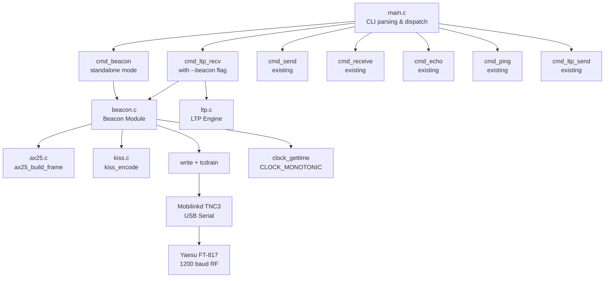
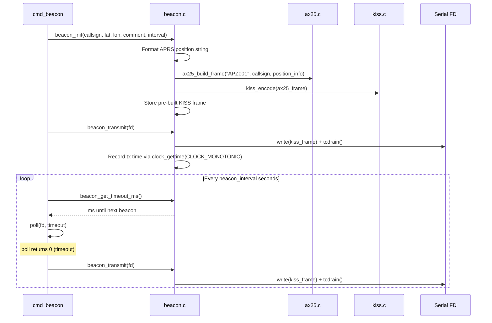
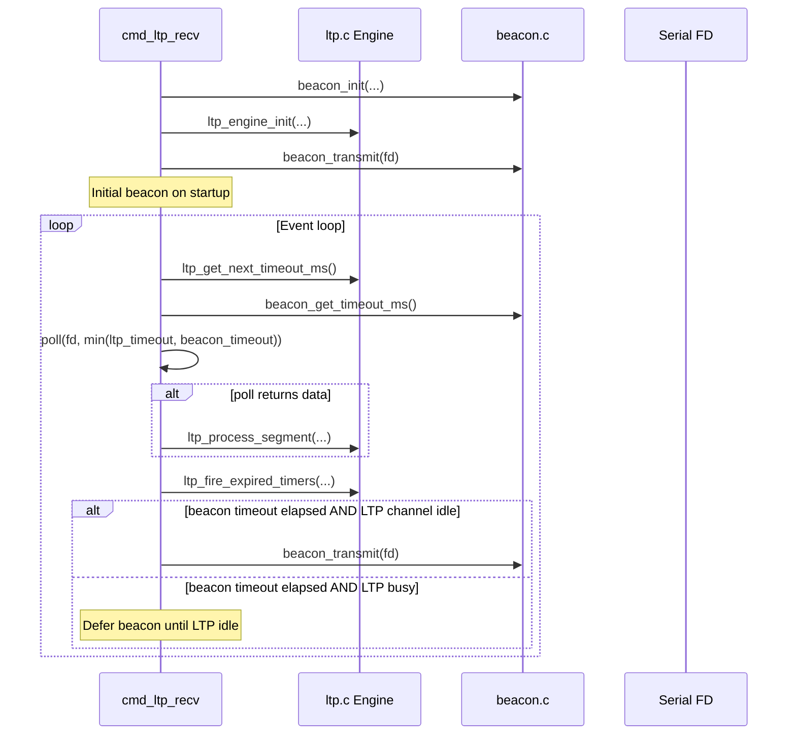
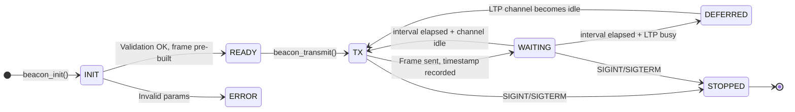

# Design Document: APRS Beacon

## Overview

This feature adds periodic APRS position beacon transmission to the existing `kiss_interface` tool. The beacon module constructs standard APRS position packets (AX.25 UI frames with uncompressed position reports) and transmits them either as a standalone beacon mode or integrated into the LTP receive event loop for OFCOM callsign identification compliance.

A new compilation unit (`beacon.h`/`beacon.c`) handles APRS position formatting, beacon state management, and periodic transmission scheduling. It reuses the existing `ax25_build_frame` and `kiss_encode` functions unchanged. The `main.c` CLI is extended with a `beacon` subcommand and a `--beacon` flag for `ltp-recv`.

### Key Design Decisions

- **Reuse `ax25_build_frame` as-is**: The beacon uses the existing 2-address frame builder (dst + src) with no digipeater path. This keeps `ax25.c` unchanged per Requirement 7.5. Digipeater path support is deferred — for direct simplex links, no path is needed.
- **Static allocation only**: All beacon state (position string, KISS frame buffer, timing) lives in a `beacon_state_t` struct with fixed-size arrays. No `malloc`/`free`.
- **CLOCK_MONOTONIC for scheduling**: Beacon intervals use `clock_gettime(CLOCK_MONOTONIC)` to avoid drift from NTP adjustments or wall-clock changes.
- **poll() integration**: Both standalone beacon mode and LTP-integrated mode use `poll()` with the beacon timeout contributing to the effective timeout calculation. In LTP mode, the timeout is `min(ltp_timeout, beacon_timeout)`.
- **Half-duplex deferral in LTP mode**: When LTP has pending transmissions (active export sessions with unsent segments, or import sessions with pending reports), the beacon is deferred until the channel is idle. The deferral tolerance is bounded at 10 seconds per Requirement 5.3.
- **TOCALL "APZ001"**: Uses the experimental APRS software TOCALL per the APRS TOCALL registry, identifying this as custom software.
- **Position precision**: APRS uncompressed format provides ~18.5m resolution (0.01 arcminute). The `snprintf` formatting with 2 decimal places on minutes satisfies the 0.02-minute (37m) accuracy requirement.

## Architecture



### Module Responsibilities

| Module | Responsibility |
|--------|---------------|
| `beacon.h` / `beacon.c` | APRS position string formatting, beacon state init/check/transmit, timeout calculation |
| `main.c` | Extended CLI parsing (`beacon` subcommand, `--beacon` flag for `ltp-recv`), `cmd_beacon` standalone loop, modified `cmd_ltp_recv` with beacon integration |
| `ax25.c` / `ax25.h` | AX.25 UI frame construction (unchanged) |
| `kiss.c` / `kiss.h` | KISS frame encoding (unchanged) |
| `serial.c` / `serial.h` | Serial port open/close/configure (unchanged) |
| `ltp.c` / `ltp.h` | LTP engine (unchanged) |

### Standalone Beacon Sequence



### LTP Receive + Beacon Integration Sequence



## Components and Interfaces

### beacon.h

```c
#ifndef BEACON_H
#define BEACON_H

#include <stdint.h>
#include <stddef.h>
#include <time.h>

/* Maximum APRS position + comment string length */
#define BEACON_MAX_COMMENT    128
#define BEACON_MAX_POSITION   256  /* "!DDMM.MMN/DDDMM.MMW-" + comment */
#define BEACON_TOCALL         "APZ001"
#define BEACON_DEFAULT_COMMENT "github.com/g4dpz/ion-dtn-terrestrial"
#define BEACON_DEFAULT_INTERVAL 120
#define BEACON_MIN_INTERVAL   10
#define BEACON_MAX_INTERVAL   3600

/* Pre-built beacon frame (AX.25 + KISS encoded, ready to write) */
typedef struct {
    /* Configuration */
    char     callsign[10];           /* "CALL-SSID\0" */
    double   lat;                    /* Decimal degrees, -90 to +90 */
    double   lon;                    /* Decimal degrees, -180 to +180 */
    char     comment[BEACON_MAX_COMMENT];
    int      interval_sec;           /* Beacon interval in seconds */

    /* Pre-built APRS position info field */
    char     position_info[BEACON_MAX_POSITION];
    size_t   position_info_len;

    /* Pre-built KISS frame (ready to write to serial) */
    uint8_t  kiss_frame[600];        /* Generous: AX25_HDR + position + KISS overhead */
    int      kiss_frame_len;

    /* Timing */
    struct timespec last_tx;         /* CLOCK_MONOTONIC time of last beacon */
    int      initialized;            /* 1 if init succeeded */
} beacon_state_t;

/* Format latitude (decimal degrees) to APRS DDMM.MMN format.
 * out must be at least 9 bytes ("DDMM.MMN\0").
 * Returns 0 on success, -1 on error (out of range). */
int beacon_format_lat(double lat, char *out, size_t out_size);

/* Format longitude (decimal degrees) to APRS DDDMM.MMW format.
 * out must be at least 10 bytes ("DDDMM.MMW\0").
 * Returns 0 on success, -1 on error (out of range). */
int beacon_format_lon(double lon, char *out, size_t out_size);

/* Build the APRS position info field string.
 * Format: "!DDMM.MMN/DDDMM.MMW-<comment>"
 * out must be at least BEACON_MAX_POSITION bytes.
 * Returns length of info string, or -1 on error. */
int beacon_build_position(double lat, double lon, const char *comment,
                          char *out, size_t out_size);

/* Initialize beacon state: validate inputs, format position, pre-build
 * the AX.25 + KISS frame. Returns 0 on success, -1 on error. */
int beacon_init(beacon_state_t *state,
                const char *callsign, double lat, double lon,
                const char *comment, int interval_sec);

/* Transmit the pre-built beacon frame on fd.
 * Updates last_tx timestamp. Logs to stdout.
 * Returns 0 on success, -1 on write error. */
int beacon_transmit(beacon_state_t *state, int fd);

/* Get milliseconds until next beacon is due.
 * Returns 0 if beacon is due now, positive ms otherwise.
 * Returns -1 if not initialized. */
int beacon_get_timeout_ms(const beacon_state_t *state);

/* Check if the beacon interval has elapsed.
 * Returns 1 if due, 0 if not, -1 if not initialized. */
int beacon_is_due(const beacon_state_t *state);

#endif
```

### main.c Extensions

```c
/* Extended mode enum */
typedef enum {
    CMD_MODE_NONE,
    CMD_MODE_SEND,
    CMD_MODE_RECEIVE,
    CMD_MODE_ECHO,
    CMD_MODE_PING,
    CMD_MODE_LTP_SEND,
    CMD_MODE_LTP_RECV,
    CMD_MODE_BEACON       /* NEW */
} cmd_mode_t;

/* Extended cli_args_t fields */
typedef struct {
    /* ... existing fields ... */

    /* Beacon options (new) */
    const char *beacon_callsign;  /* --callsign */
    double      beacon_lat;       /* --lat */
    double      beacon_lon;       /* --lon */
    const char *beacon_comment;   /* --comment */
    int         beacon_interval;  /* --beacon-interval (seconds) */
    int         beacon_enabled;   /* --beacon flag (for ltp-recv) */
    /* --path deferred for initial implementation */

    cmd_mode_t  mode;
} cli_args_t;

/* New command function */
int cmd_beacon(int fd, const char *callsign, double lat, double lon,
               const char *comment, int interval_sec, int verbose);
```

### Existing Interfaces (unchanged)

- `ax25.h` — `ax25_build_frame()`, `ax25_encode_addr()`, `ax25_decode_addr()`, `ax25_strip_frame()`
- `kiss.h` — `kiss_encode()`, `kiss_decoder_feed()`, `kiss_decoder_init()`
- `serial.h` — `serial_open()`, `serial_close()`, `serial_configure_tnc()`, `serial_parse_device()`
- `ltp.h` — `ltp_engine_init()`, `ltp_engine_run()`, `ltp_get_next_timeout_ms()`, `ltp_fire_expired_timers()`, `ltp_process_segment()`

## Data Models

### APRS Position String Format

```
!DDMM.MMN/DDDMM.MMW-comment
│││      │││        ││
││└──────┘│└────────┘│
││ lat    ││ lon     │
│└ data   │└ symbol  └ symbol code (house/QTH)
│  type   │  table
│  id     │  selector
└ APRS    └ "/"
  "!"
```

Example: 52.467°N, 2.022°W → `!5228.02N/00201.32W-github.com/g4dpz/ion-dtn-terrestrial`

Conversion from decimal degrees to DDMM.MM:
```
degrees = floor(abs(lat))
minutes = (abs(lat) - degrees) * 60.0
formatted = sprintf("%02d%05.2f", degrees, minutes)  // lat
formatted = sprintf("%03d%05.2f", degrees, minutes)  // lon
hemisphere = lat >= 0 ? 'N' : 'S'  // lat
hemisphere = lon >= 0 ? 'E' : 'W'  // lon
```

### Frame Nesting (APRS Beacon)

```
KISS Frame:
┌──────┬──────┬─────────────────────────────────┬──────┐
│ FEND │ 0x00 │ AX.25 Frame (byte-stuffed)      │ FEND │
└──────┴──────┴─────────────────────────────────┴──────┘

AX.25 UI Frame (before byte-stuffing):
┌──────────────┬──────────────┬──────┬──────┬──────────────────────────────────┐
│ Dst: APZ001  │ Src: CALL-SS │ 0x03 │ 0xF0 │ !DDMM.MMN/DDDMM.MMW-comment    │
│ (7 bytes)    │ (7 bytes)    │      │      │                                  │
└──────────────┴──────────────┴──────┴──────┴──────────────────────────────────┘
```

### Beacon State Machine



### Beacon Timeout Calculation

```c
/* In standalone beacon mode: */
poll_timeout = beacon_get_timeout_ms(&beacon);

/* In LTP recv + beacon mode: */
int ltp_timeout = ltp_get_next_timeout_ms(eng);
int bcn_timeout = beacon_get_timeout_ms(&beacon);

if (ltp_timeout < 0)
    poll_timeout = bcn_timeout;       /* No LTP timers, use beacon */
else if (bcn_timeout < 0)
    poll_timeout = ltp_timeout;       /* No beacon (shouldn't happen) */
else
    poll_timeout = (ltp_timeout < bcn_timeout) ? ltp_timeout : bcn_timeout;
```

### LTP Channel Idle Check

The beacon is only transmitted when the LTP engine has no pending outbound work:

```c
/* Returns 1 if LTP has no pending transmissions */
int ltp_channel_idle(const ltp_engine_t *eng) {
    /* Check export sessions: any active and not completed? */
    for (int i = 0; i < LTP_MAX_EXPORT_SESSIONS; i++) {
        if (eng->export_sessions[i].active && !eng->export_sessions[i].completed)
            return 0;
    }
    /* No active export sessions with pending data */
    return 1;
}
```

Note: In receive-only mode, the LTP engine typically has no export sessions. Import sessions generate report segments, but these are sent immediately upon checkpoint receipt and don't queue. So in practice, the channel is idle most of the time during `ltp-recv`, and beacons transmit on schedule.

### CLI Options Summary

| Option | Subcommand | Required | Default | Description |
|--------|-----------|----------|---------|-------------|
| `--callsign` | `beacon`, `ltp-recv --beacon` | Yes | — | Source callsign-SSID |
| `--lat` | `beacon`, `ltp-recv --beacon` | Yes | — | Latitude in decimal degrees |
| `--lon` | `beacon`, `ltp-recv --beacon` | Yes | — | Longitude in decimal degrees |
| `--comment` | `beacon`, `ltp-recv --beacon` | No | `"github.com/g4dpz/ion-dtn-terrestrial"` | APRS comment text |
| `--beacon-interval` | `beacon`, `ltp-recv --beacon` | No | 120 | Seconds between beacons |
| `--beacon` | `ltp-recv` | No | off | Enable beaconing in LTP recv |
| `--device` | all | Yes | — | Serial device path |
| `--txdelay` | all | No | 500 | TX-delay in ms |
| `--txtail` | all | No | 300 | TX-tail in ms |

### Configuration Defaults

| Parameter | Default | Range |
|-----------|---------|-------|
| Beacon interval | 120 seconds | 10–3600 |
| Comment | `"github.com/g4dpz/ion-dtn-terrestrial"` | up to 128 chars |
| TOCALL | `APZ001` | fixed |
| Symbol table | `/` | fixed |
| Symbol code | `-` (house/QTH) | fixed |
| Latitude | — | -90.0 to +90.0 |
| Longitude | — | -180.0 to +180.0 |

## Correctness Properties

*A property is a characteristic or behavior that should hold true across all valid executions of a system — essentially, a formal statement about what the system should do. Properties serve as the bridge between human-readable specifications and machine-verifiable correctness guarantees.*

### Property 1: Beacon frame construction round-trip

*For any* valid callsign (1–6 alphanumeric characters, optional SSID 0–15), latitude in [-90, +90], longitude in [-180, +180], and comment string (0–128 characters), building a beacon with `beacon_init` and then stripping the pre-built AX.25 frame with `ax25_strip_frame` SHALL produce a destination callsign of "APZ001-0", a source callsign matching the input callsign, and an information field whose content starts with `!` and contains the comment string.

**Validates: Requirements 1.1, 5.1**

### Property 2: Position string structural invariants

*For any* latitude in [-90, +90] and longitude in [-180, +180] and comment string, the output of `beacon_build_position` SHALL: start with `!`, have the latitude field at bytes 1–8 matching the pattern `DDMM.MMH` where DD is in [00,90], MM.MM is in [00.00,59.99], and H is `N` for non-negative latitude or `S` for negative latitude; have `/` as the symbol table selector at byte 9; have the longitude field at bytes 10–18 matching `DDDMM.MMH` where DDD is in [000,180], MM.MM is in [00.00,59.99], and H is `E` for non-negative longitude or `W` for negative longitude; have `-` as the symbol code at byte 19; and end with the comment string.

**Validates: Requirements 1.2, 8.1, 8.2, 8.3, 8.4**

### Property 3: Coordinate conversion round-trip

*For any* latitude in [-90, +90] and longitude in [-180, +180], formatting with `beacon_format_lat`/`beacon_format_lon` and then parsing the resulting DDMM.MM string back to decimal degrees SHALL yield values within 0.02 arcminutes (approximately 37 metres) of the original input.

**Validates: Requirements 1.3, 8.5**

### Property 4: Invalid input rejection

*For any* callsign that is empty, longer than 6 characters (excluding SSID), or contains non-alphanumeric characters, `beacon_init` SHALL return -1. *For any* latitude outside [-90, +90] or longitude outside [-180, +180], `beacon_format_lat`/`beacon_format_lon` SHALL return -1.

**Validates: Requirements 1.7, 1.8**

### Property 5: Beacon interval validation

*For any* integer interval value, `beacon_init` SHALL succeed (return 0) when the interval is in [10, 3600] and SHALL fail (return -1) when the interval is outside that range, given otherwise valid inputs.

**Validates: Requirements 3.4**

### Property 6: Beacon timeout calculation correctness

*For any* initialized beacon state with a known `last_tx` timestamp and interval, `beacon_get_timeout_ms` SHALL return a non-negative value equal to `max(0, (last_tx + interval) - now)` in milliseconds, where `now` is the current CLOCK_MONOTONIC time. When the interval has elapsed, it SHALL return 0.

**Validates: Requirements 4.5**

## Error Handling

| Condition | Behavior |
|-----------|----------|
| Empty callsign or callsign > 6 chars (excl. SSID) | `beacon_init` returns -1 |
| Callsign contains non-alphanumeric characters | `beacon_init` returns -1 |
| Latitude outside [-90.0, +90.0] | `beacon_format_lat` / `beacon_init` returns -1 |
| Longitude outside [-180.0, +180.0] | `beacon_format_lon` / `beacon_init` returns -1 |
| Beacon interval outside [10, 3600] | `beacon_init` returns -1 |
| Comment string exceeds BEACON_MAX_COMMENT | `beacon_init` truncates to fit |
| `ax25_build_frame` fails (shouldn't with valid inputs) | `beacon_init` returns -1 |
| `kiss_encode` fails (shouldn't with valid frame) | `beacon_init` returns -1 |
| Serial write failure during `beacon_transmit` | Returns -1, logs error to stderr |
| Short write during `beacon_transmit` | Returns -1, logs error to stderr |
| `beacon_get_timeout_ms` called before init | Returns -1 |
| `beacon_is_due` called before init | Returns -1 |
| Missing `--callsign`, `--lat`, or `--lon` for beacon mode | Print error to stderr, exit with code 1 |
| Missing `--device` for beacon mode | Print error to stderr, exit with code 1 |
| Missing beacon options when `--beacon` used with `ltp-recv` | Print error to stderr, exit with code 1 |
| SIGINT / SIGTERM | Set `g_running = 0`, exit beacon loop cleanly with code 0 |

## Testing Strategy

### Property-Based Tests (using [theft](https://github.com/silentbicycle/theft) — C PBT library)

Each property test runs a minimum of 100 trials (configured for 1000). If `theft` is not available, tests fall back to a hand-rolled random loop using `rand()`/`srand(time(NULL))` with 1000 iterations, consistent with the existing test pattern.

| Test File | Test | Property | Iterations |
|-----------|------|----------|------------|
| `test_beacon.c` | `test_beacon_frame_roundtrip` | Property 1: Beacon frame construction round-trip | 1000 |
| `test_beacon.c` | `test_position_string_structure` | Property 2: Position string structural invariants | 1000 |
| `test_beacon.c` | `test_coordinate_roundtrip` | Property 3: Coordinate conversion round-trip | 1000 |
| `test_beacon.c` | `test_invalid_input_rejection` | Property 4: Invalid input rejection | 1000 |
| `test_beacon.c` | `test_interval_validation` | Property 5: Beacon interval validation | 1000 |
| `test_beacon.c` | `test_timeout_calculation` | Property 6: Beacon timeout calculation correctness | 1000 |

Each test is tagged with: `/* Feature: aprs-beacon, Property N: <title> */`

### Unit Tests (example-based)

| Test File | Test | Validates |
|-----------|------|-----------|
| `test_beacon.c` | Format lat 52.467 → "5228.02N" | Req 1.3, 8.1 |
| `test_beacon.c` | Format lon -2.022 → "00201.32W" | Req 1.3, 8.2 |
| `test_beacon.c` | Format lat 0.0 → "0000.00N" | Edge: equator |
| `test_beacon.c` | Format lon 0.0 → "00000.00E" | Edge: prime meridian |
| `test_beacon.c` | Format lat -90.0 → "9000.00S" | Edge: south pole |
| `test_beacon.c` | Format lon 180.0 → "18000.00E" | Edge: antimeridian |
| `test_beacon.c` | Build position with empty comment | Req 1.6 |
| `test_beacon.c` | Build position with default comment | Req 6.5 |
| `test_beacon.c` | beacon_init with "APZ001" as TOCALL | Req 1.1 |
| `test_beacon.c` | beacon_init sets control=0x03, PID=0xF0 | Req 1.4 |
| `test_beacon.c` | beacon_init rejects empty callsign | Req 1.7 |
| `test_beacon.c` | beacon_init rejects lat=91.0 | Req 1.8 |
| `test_beacon.c` | beacon_init rejects interval=5 | Req 3.4 |
| `test_beacon.c` | beacon_init accepts interval=120 | Req 3.4 |
| `test_cli.c` | CLI parses `beacon` subcommand | Req 6.1 |
| `test_cli.c` | CLI parses `--callsign`, `--lat`, `--lon` | Req 6.1 |
| `test_cli.c` | CLI parses `--beacon` flag for `ltp-recv` | Req 6.1 |
| `test_cli.c` | CLI default comment is "github.com/g4dpz/ion-dtn-terrestrial" | Req 6.5 |
| `test_cli.c` | CLI default beacon-interval is 120 | Req 6.6 |
| `test_cli.c` | CLI rejects beacon mode without --callsign | Req 6.2 |
| `test_cli.c` | CLI rejects ltp-recv --beacon without --lat | Req 6.3 |
| `test_cli.c` | --help includes beacon options | Req 6.4 |

### Integration Tests (manual, with hardware)

| Test | Validates |
|------|-----------|
| Run `beacon` mode, verify packet decoded by direwolf/Xastir | Req 1.2, 8.1–8.5 |
| Run `beacon` mode, verify first beacon is immediate | Req 3.1 |
| Run `beacon` mode, verify beacons repeat at configured interval | Req 3.1, 5.2 |
| Ctrl-C exits beacon mode cleanly | Req 3.5 |
| Run `ltp-recv --beacon`, verify beacons during idle periods | Req 4.1, 4.2 |
| Run `ltp-recv --beacon` under LTP load, verify beacon deferral | Req 4.3, 5.3 |

### Build & Test

```makefile
# Added to existing Makefile:

SRC = main.c kiss.c ax25.c serial.c ping.c ltp.c sdnv.c beacon.c
OBJ = $(SRC:.c=.o)

test_beacon: test_beacon.c beacon.c ax25.c kiss.c
	$(CC) $(CFLAGS) -o $@ $^ $(THEFT_FLAGS)

test: test_kiss test_ax25 test_serial test_cli test_ping test_sdnv test_ltp test_beacon
	./test_kiss
	./test_ax25
	./test_serial
	./test_cli
	./test_ping
	./test_sdnv
	./test_ltp
	./test_beacon
```

Note: If `theft` is not available, the property tests fall back to a hand-rolled random loop using `rand()` / `srand(time(NULL))` — the key requirement is 100+ iterations per property with random inputs, consistent with the existing test pattern in the codebase.
