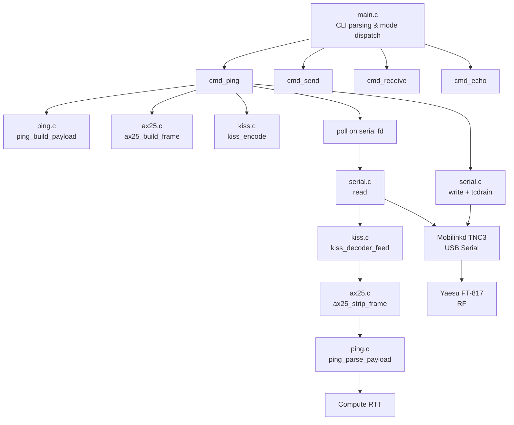
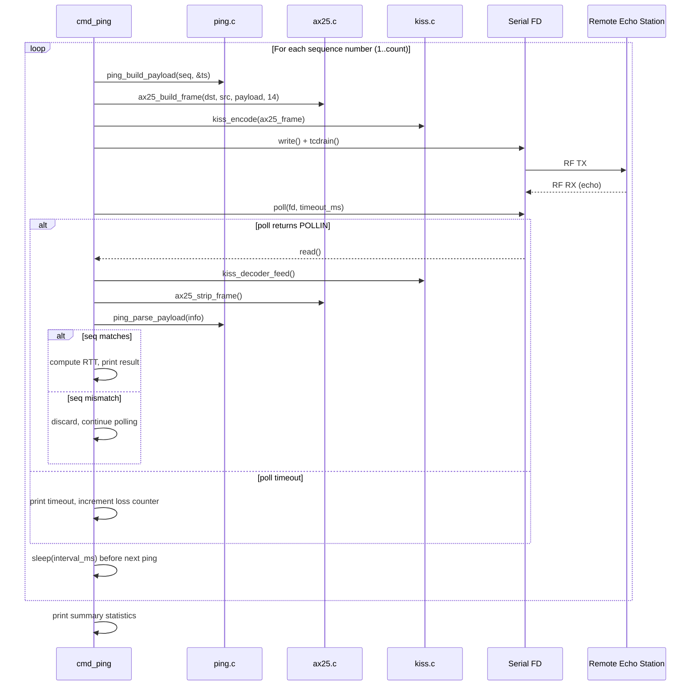

# Design Document: KISS Ping

## Overview

A `ping` subcommand for the existing `kiss_interface` tool that sends timestamped, sequence-numbered packets over the KISS/AX.25 stack, waits for echo replies from a remote station (running `echo` mode), and measures round-trip time. The feature supports configurable count, interval, and timeout, prints per-ping results in real time, and outputs summary statistics (min/avg/max RTT, packet loss) on completion or SIGINT.

This exercises the single-fd bidirectional TX/RX pattern on the serial link and provides RTT measurements useful for estimating one-way light time for LTP retransmission timers.

### Key Design Decisions

- **New module `ping.h`/`ping.c`**: Payload construction/parsing is isolated in a small module to enable unit testing independently of serial I/O and CLI logic. The send/receive orchestration lives in `cmd_ping()` in `main.c`, following the existing `cmd_send`/`cmd_receive`/`cmd_echo` pattern.
- **`poll()` for timeout**: Rather than alarm-based or thread-based approaches, `poll()` on the serial fd provides clean per-packet timeout with millisecond granularity. This is the same POSIX pattern needed for future LTP handshake logic.
- **`clock_gettime(CLOCK_MONOTONIC)`**: Monotonic clock avoids NTP jumps and provides microsecond-resolution timestamps for RTT calculation. The 8-byte timestamp in the payload is `int64_t` microseconds since an arbitrary epoch.
- **No dynamic allocation**: All buffers are stack-allocated, consistent with the existing codebase. The statistics accumulator uses fixed-size counters.
- **Payload format**: A fixed 14-byte structure (4-byte magic + 2-byte sequence + 8-byte timestamp) keeps the ping packet small and deterministic. The magic bytes "PING" allow the echo station to retransmit without any special handling — it just echoes the raw payload.

## Architecture



### Module Responsibilities

| Module | Responsibility |
|--------|---------------|
| `main.c` | CLI argument parsing (extended for `ping`), `cmd_ping()` orchestration loop, signal handling, summary output |
| `ping.h` / `ping.c` | Ping payload construction (`ping_build_payload`), parsing (`ping_parse_payload`), timestamp helper |
| `kiss.c` / `kiss.h` | KISS frame encoding/decoding (unchanged) |
| `ax25.c` / `ax25.h` | AX.25 UI frame build/strip (unchanged) |
| `serial.c` / `serial.h` | Serial port open/close/configure (unchanged) |

### Ping Cycle Sequence



## Components and Interfaces

### ping.h (new)

```c
#ifndef PING_H
#define PING_H

#include <stdint.h>
#include <stddef.h>

#define PING_MAGIC      "PING"
#define PING_MAGIC_LEN  4
#define PING_PAYLOAD_LEN 14  /* 4 magic + 2 seq + 8 timestamp */

/* Build a ping payload into out (must be >= PING_PAYLOAD_LEN bytes).
 * seq: sequence number (network byte order in output).
 * tx_us: transmit timestamp in microseconds (from clock_gettime CLOCK_MONOTONIC).
 * Returns 0 on success, -1 on error. */
int ping_build_payload(uint16_t seq, int64_t tx_us,
                       uint8_t *out, size_t out_size);

/* Parse a ping payload from a buffer.
 * Returns 0 on success, -1 if magic mismatch or buffer too small.
 * Sets *seq and *tx_us on success. */
int ping_parse_payload(const uint8_t *data, size_t len,
                       uint16_t *seq, int64_t *tx_us);

/* Get current monotonic time in microseconds. */
int64_t ping_now_us(void);

#endif
```

### main.c extensions

```c
/* New mode enum value */
typedef enum {
    CMD_MODE_NONE,
    CMD_MODE_SEND,
    CMD_MODE_RECEIVE,
    CMD_MODE_ECHO,
    CMD_MODE_PING       /* NEW */
} cmd_mode_t;

/* Extended cli_args_t fields */
typedef struct {
    /* ... existing fields ... */
    int         count;       /* Ping count (default 4) */
    int         timeout_ms;  /* Per-ping timeout in ms (default 5000) */
    int         interval_ms; /* Inter-ping delay in ms (default 1000) */
    cmd_mode_t  mode;
} cli_args_t;

/* New command function */
int cmd_ping(int fd, const char *src, const char *dst,
             int count, int timeout_ms, int interval_ms, int verbose);
```

### Existing interfaces (unchanged)

- `kiss.h` — `kiss_encode()`, `kiss_decoder_feed()`, `kiss_decoder_init()`
- `ax25.h` — `ax25_build_frame()`, `ax25_strip_frame()`
- `serial.h` — `serial_open()`, `serial_close()`, `serial_configure_tnc()`, `serial_parse_device()`

## Data Models

### Ping Payload Layout (14 bytes)

```
Offset  Size  Field           Encoding
──────  ────  ──────────────  ────────────────────────
0       4     Magic           ASCII "PING" (0x50 0x49 0x4E 0x47)
4       2     Sequence Number uint16_t, network byte order (big-endian)
6       8     TX Timestamp    int64_t, network byte order, microseconds (CLOCK_MONOTONIC)
```

### Frame Nesting (ping packet)

```
KISS Frame:
┌──────┬──────┬─────────────────────────────────┬──────┐
│ FEND │ 0x00 │ AX.25 Frame (byte-stuffed)      │ FEND │
└──────┴──────┴─────────────────────────────────┴──────┘

AX.25 UI Frame (before byte-stuffing):
┌──────────────┬──────────────┬──────┬──────┬────────────────┐
│ Dst Addr (7) │ Src Addr (7) │ 0x03 │ 0xF0 │ Ping Payload   │
└──────────────┴──────────────┴──────┴──────┴────────────────┘
                                              │ 14 bytes       │

Ping Payload:
┌──────────┬─────────┬──────────────┐
│ "PING"   │ Seq (2) │ TX Time (8)  │
│ 4 bytes  │ NBO     │ NBO μs       │
└──────────┴─────────┴──────────────┘
```

### Statistics Accumulator

```c
typedef struct {
    int     sent;       /* Packets transmitted */
    int     received;   /* Echo replies received */
    double  rtt_min;    /* Minimum RTT in ms */
    double  rtt_max;    /* Maximum RTT in ms */
    double  rtt_sum;    /* Sum of all RTTs for average calculation */
} ping_stats_t;
```

### CLI Argument Defaults

| Option | Default | Range |
|--------|---------|-------|
| `--count` | 4 | 1–65535 |
| `--timeout` | 5000 ms | 100–60000 ms |
| `--interval` | 1000 ms | 0–60000 ms |

### cmd_ping Flow (pseudocode)

```
print header: "PING <dst> from <src>: <count> packets"
for seq = 1 to count (while g_running):
    build ping payload (seq, now_us)
    build AX.25 frame (dst, src, payload)
    KISS-encode and write to fd, tcdrain
    
    remaining_ms = timeout_ms
    loop:
        poll(fd, remaining_ms)
        if timeout: print "seq <N> timeout", stats.sent++, break
        read bytes, feed to KISS decoder
        if complete frame:
            strip AX.25, parse ping payload
            if magic matches and seq matches:
                rtt = now_us - tx_us
                print result line
                update stats (min, max, sum, received)
                break
            else: discard, adjust remaining_ms, continue
    
    if seq < count and g_running:
        usleep(interval_ms * 1000)

print summary statistics
```


## Correctness Properties

*A property is a characteristic or behavior that should hold true across all valid executions of a system — essentially, a formal statement about what the system should do. Properties serve as the bridge between human-readable specifications and machine-verifiable correctness guarantees.*

### Property 1: Ping payload round-trip

*For any* sequence number in the range 0–65535 and any valid monotonic timestamp value (non-negative `int64_t`), constructing a ping payload with `ping_build_payload` and then parsing the resulting byte sequence with `ping_parse_payload` SHALL recover the original sequence number and timestamp exactly.

**Validates: Requirements 8.1**

### Property 2: Ping payload structural invariant

*For any* sequence number and timestamp, the output of `ping_build_payload` SHALL be exactly 14 bytes, with bytes 0–3 equal to ASCII "PING" (0x50 0x49 0x4E 0x47), bytes 4–5 containing the sequence number in network byte order, and bytes 6–13 containing the timestamp in network byte order.

**Validates: Requirements 2.1**

### Property 3: Non-ping payload rejection

*For any* byte buffer of length ≥ 1 whose first 4 bytes are NOT equal to ASCII "PING", `ping_parse_payload` SHALL return -1 (failure) without modifying the output parameters.

**Validates: Requirements 8.3**

## Error Handling

| Condition | Behavior |
|-----------|----------|
| Missing `--device`, `--src`, or `--dst` for ping mode | Print specific error identifying the missing argument, exit with code 1 |
| `--count` value ≤ 0 | Print error to stderr, exit with code 1 |
| `--timeout` value ≤ 0 | Print error to stderr, exit with code 1 |
| Serial port open fails | Print error to stderr, exit with code 1 |
| `write()` fails (not EINTR) | Print error to stderr, exit with code 1 |
| `poll()` returns error (not EINTR) | Print error to stderr, exit ping loop |
| `read()` fails (not EINTR) | Print error to stderr, exit ping loop |
| KISS frame decode error | Discard frame, continue waiting for timeout |
| AX.25 frame too short or invalid | Discard frame, continue waiting for timeout |
| Ping payload magic mismatch | Discard payload, continue waiting for timeout |
| Sequence number mismatch | Discard reply, continue waiting for timeout (adjust remaining timeout) |
| `poll()` timeout expires | Print timeout message with seq number, increment loss counter, proceed to next ping |
| SIGINT / SIGTERM received | Set `g_running = 0`, exit ping loop, print summary, close serial, exit 0 |
| Payload buffer too small for `ping_build_payload` | Return -1 (defensive check) |
| Parse buffer too small (< PING_PAYLOAD_LEN) | Return -1 |

### Signal Handling

The existing `g_running` flag and `sigaction()` setup from the current codebase is reused. The `cmd_ping` loop checks `g_running` before each send iteration and after `poll()` returns. When interrupted, the loop falls through to the summary print logic, ensuring partial results are always reported.

## Testing Strategy

### Property-Based Tests (using [theft](https://github.com/silentbicycle/theft) — C PBT library)

Each property test runs a minimum of 100 trials (configured for 1000).

| Test | Property | Iterations |
|------|----------|------------|
| `test_ping_roundtrip` | Property 1: Ping payload round-trip | 1000 |
| `test_ping_structure` | Property 2: Ping payload structural invariant | 1000 |
| `test_ping_reject_non_ping` | Property 3: Non-ping payload rejection | 1000 |

Each test is tagged with: `/* Feature: kiss-ping, Property N: <title> */`

If `theft` is not available, the property tests fall back to a hand-rolled random loop using `rand()`/`srand(time(NULL))` with 1000 iterations, consistent with the existing test pattern in the codebase.

### Unit Tests (example-based)

| Test | Validates |
|------|-----------|
| `ping_build_payload` with seq=1, known timestamp produces expected bytes | Req 2.1 |
| `ping_parse_payload` with buffer < 14 bytes returns -1 | Req 8.3 |
| `ping_parse_payload` with exactly 14 valid bytes succeeds | Req 8.1 |
| `ping_build_payload` with out_size < 14 returns -1 | Defensive |
| CLI parses `ping` subcommand, sets CMD_MODE_PING | Req 1.1 |
| CLI parses `--count`, `--timeout`, `--interval` with values | Req 1.3, 1.4, 1.5 |
| CLI defaults: count=4, timeout=5000, interval=1000 | Req 1.3, 1.4, 1.5 |
| Missing `--device` for ping prints error, returns -1 | Req 1.6 |
| Missing `--src` for ping prints error, returns -1 | Req 1.6 |
| Missing `--dst` for ping prints error, returns -1 | Req 1.6 |
| `--help` output contains "ping", "--count", "--timeout", "--interval" | Req 1.7 |
| Sequence number starts at 1 | Req 2.3 |

### Integration Tests (manual, with hardware)

| Test | Validates |
|------|-----------|
| Ping remote echo station, verify per-ping RTT output | Req 3.1–3.6, 5.1 |
| Ping with `--count 3`, verify 3 pings sent and summary printed | Req 5.3, 6.1 |
| Ping unreachable station, verify timeout messages | Req 4.1, 4.2, 4.3 |
| Ping with `--verbose`, verify hex dump output | Req 5.2 |
| Ctrl-C during ping session, verify summary printed and exit 0 | Req 7.1, 7.2, 7.3 |
| Verify min/avg/max RTT in summary with multiple successful pings | Req 6.2, 6.3 |

### Build Integration

New Makefile targets:

```makefile
# New source added to main build
SRC = main.c kiss.c ax25.c serial.c ping.c

# New test target
test_ping: test_ping.c ping.c
	$(CC) $(CFLAGS) -o $@ $^ $(THEFT_FLAGS)

# Extended CLI test (recompile with ping support)
test_cli: test_cli.c main.c kiss.c ax25.c serial.c ping.c
	$(CC) $(CFLAGS) -DTEST_CLI_MODE -o $@ $^

test: test_kiss test_ax25 test_serial test_cli test_ping
	./test_kiss
	./test_ax25
	./test_serial
	./test_cli
	./test_ping
```
