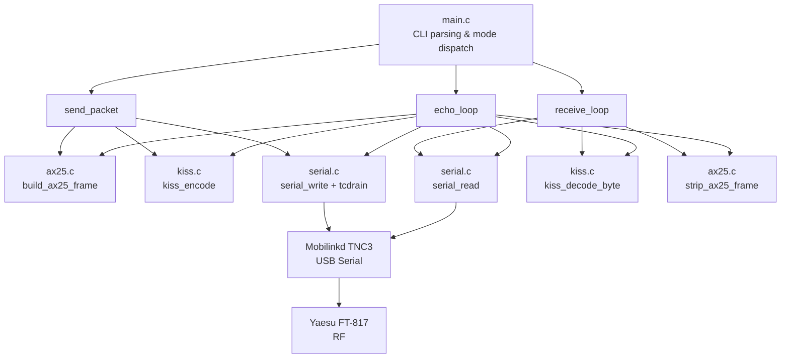
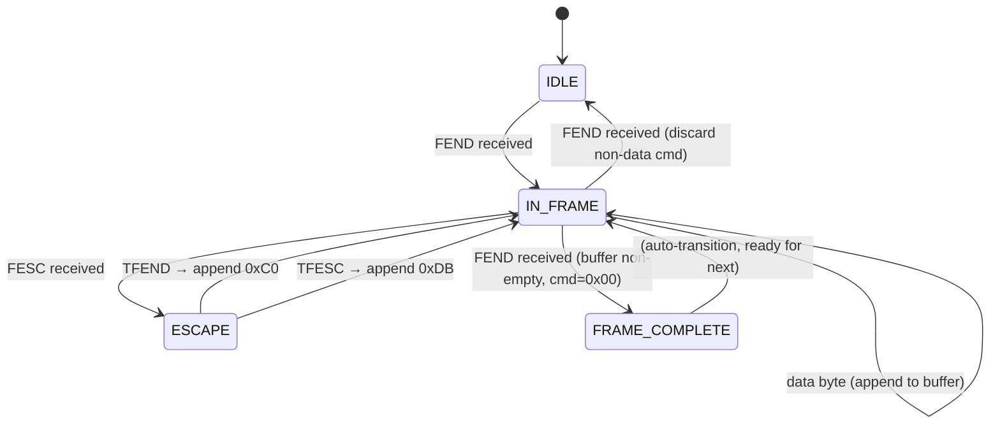

# Design Document: KISS USB Interface

## Overview

A standalone C command-line tool (`kiss_interface`) that communicates with a Mobilinkd TNC3 over USB serial using the KISS protocol. It wraps payloads in AX.25 UI frames for amateur radio transmission via a Yaesu FT-817. The tool supports three modes: `send` (transmit a single payload), `receive` (continuously print received packets), and `echo` (receive-and-retransmit for link testing).

The tool is independent of ION-DTN — it uses only standard C and POSIX APIs. The architecture is derived from the proven patterns in `ionserialcla.c` but stripped of all ION/LTP dependencies.

### Key Design Decisions

- **Single-file vs modular**: The tool is split into separate compilation units (`kiss.c`, `ax25.c`, `serial.c`, `main.c`) to enable unit testing of KISS and AX.25 logic independently from serial I/O.
- **No threads**: Unlike `ionserialcla` which uses a TX/RX thread pair, this tool uses a single-threaded event loop. `send` mode is fire-and-forget. `receive` and `echo` modes use blocking reads with signal-based termination.
- **Buffer sizes**: Maximum KISS frame payload is 65535 bytes (matching requirement 3.5). AX.25 header is fixed at 16 bytes. Maximum AX.25 information field is 65535 - 16 = 65519 bytes.
- **No dynamic allocation**: All buffers are stack-allocated or statically sized, avoiding malloc/free complexity and memory leaks.

## Architecture



### Module Responsibilities

| Module | Responsibility |
|--------|---------------|
| `main.c` | CLI argument parsing, mode dispatch, signal handling, program lifecycle |
| `kiss.c` / `kiss.h` | KISS frame encoding (byte-stuffing) and decoding (state machine) |
| `ax25.c` / `ax25.h` | AX.25 UI frame construction, parsing, callsign encoding/decoding |
| `serial.c` / `serial.h` | Serial port open/close, termios configuration, KISS TNC parameter setup |

## Components and Interfaces

### kiss.h

```c
#ifndef KISS_H
#define KISS_H

#include <stdint.h>
#include <stddef.h>

#define KISS_FEND  0xC0
#define KISS_FESC  0xDB
#define KISS_TFEND 0xDC
#define KISS_TFESC 0xDD

#define KISS_MAX_PAYLOAD 65535

/* Encode payload into KISS frame. Returns frame length, or -1 on error.
 * out must be at least (len * 2 + 3) bytes. */
int kiss_encode(const uint8_t *payload, size_t len,
                uint8_t *out, size_t out_size);

/* Stateful KISS decoder (byte-at-a-time state machine) */
typedef struct {
    uint8_t buf[KISS_MAX_PAYLOAD + 1]; /* +1 for command byte */
    size_t  len;
    int     in_frame;
    int     escape;
} kiss_decoder_t;

void kiss_decoder_init(kiss_decoder_t *dec);

/* Feed one byte. Returns 1 when a complete data frame is available.
 * On return 1, copies payload (without command byte) to out, sets *out_len.
 * Returns 0 if more bytes needed, -1 on error (overflow, non-data cmd). */
int kiss_decoder_feed(kiss_decoder_t *dec, uint8_t byte,
                      uint8_t *out, size_t out_size, size_t *out_len);

/* Build a KISS command frame (e.g. TX-delay, TX-tail).
 * cmd: command type (0x01=txdelay, 0x04=txtail, etc.)
 * value: parameter value byte.
 * out must be at least 4 bytes. Returns frame length (always 4). */
int kiss_build_cmd(uint8_t cmd, uint8_t value, uint8_t *out, size_t out_size);

#endif
```

### ax25.h

```c
#ifndef AX25_H
#define AX25_H

#include <stdint.h>
#include <stddef.h>

#define AX25_ADDR_LEN    7
#define AX25_HDR_LEN     16  /* 7 dst + 7 src + 1 ctrl + 1 pid */
#define AX25_CTRL_UI     0x03
#define AX25_PID_NOLAYER3 0xF0
#define AX25_MAX_CALLSIGN 9  /* "ABCDEF-15" + NUL */
#define AX25_MAX_INFO    (KISS_MAX_PAYLOAD - AX25_HDR_LEN)

/* Encode a callsign string (e.g. "G4DPZ-1") into a 7-byte AX.25 address field.
 * last: set to 1 for the final address field (sets extension bit). */
int ax25_encode_addr(const char *callsign, uint8_t out[AX25_ADDR_LEN], int last);

/* Decode a 7-byte AX.25 address field back to a callsign string.
 * out must be at least AX25_MAX_CALLSIGN bytes. */
int ax25_decode_addr(const uint8_t addr[AX25_ADDR_LEN], char *out, size_t out_size);

/* Build a complete AX.25 UI frame. Returns total frame length, or -1 on error. */
int ax25_build_frame(const char *dst_call, const char *src_call,
                     const uint8_t *info, size_t info_len,
                     uint8_t *out, size_t out_size);

/* Strip AX.25 header from a frame. Returns info field length, or -1 on error.
 * Sets *src_call and *dst_call if non-NULL (must be AX25_MAX_CALLSIGN bytes).
 * Sets *info to point into frame buffer at the info field start. */
int ax25_strip_frame(const uint8_t *frame, size_t frame_len,
                     char *src_call, char *dst_call,
                     const uint8_t **info);

#endif
```

### serial.h

```c
#ifndef SERIAL_H
#define SERIAL_H

/* Open serial port in raw 8N1 mode. Returns fd or -1 on error. */
int serial_open(const char *device, int baud);

/* Close serial port. */
void serial_close(int fd);

/* Send KISS TNC parameter commands (TX-delay, TX-tail).
 * txdelay_ms and txtail_ms are in milliseconds; converted to 10ms units. */
int serial_configure_tnc(int fd, int txdelay_ms, int txtail_ms);

/* Parse "device:baud" string. Sets *baud to 9600 if not specified. */
int serial_parse_device(const char *arg, char *device, size_t dev_size, int *baud);

#endif
```

### main.c Interface

```c
/* Mode functions called from main after CLI parsing */
int cmd_send(int fd, const char *src, const char *dst,
             const char *payload, int verbose);

int cmd_receive(int fd, int verbose);

int cmd_echo(int fd, const char *src, const char *dst,
             int delay_ms, int verbose);
```

## Data Models

### KISS Decoder State Machine



### CLI Argument Structure

```c
typedef struct {
    const char *device;     /* Serial device path */
    int         baud;       /* Baud rate (default 9600) */
    const char *src_call;   /* Source callsign */
    const char *dst_call;   /* Destination callsign */
    const char *payload;    /* Payload string (send mode only) */
    int         txdelay_ms; /* TX-delay in ms (default 500) */
    int         txtail_ms;  /* TX-tail in ms (default 300) */
    int         delay_ms;   /* Echo delay in ms (default 1000) */
    int         verbose;    /* Verbose/debug output flag */
    enum { MODE_NONE, MODE_SEND, MODE_RECEIVE, MODE_ECHO } mode;
} cli_args_t;
```

### AX.25 Address Field Layout (7 bytes)

| Byte | Bits | Content |
|------|------|---------|
| 0-5 | 7:1 | Callsign character left-shifted by 1, space-padded |
| 6 | 7 | 0 |
| 6 | 6:5 | 11 (reserved bits, set per convention) |
| 6 | 4:1 | SSID (0-15) |
| 6 | 0 | Address extension bit (1 = last address field) |

### Frame Nesting

```
KISS Frame:
┌──────┬──────┬─────────────────────────────────┬──────┐
│ FEND │ 0x00 │ AX.25 Frame (byte-stuffed)      │ FEND │
└──────┴──────┴─────────────────────────────────┴──────┘

AX.25 UI Frame (before byte-stuffing):
┌──────────────┬──────────────┬──────┬──────┬──────────────┐
│ Dst Addr (7) │ Src Addr (7) │ 0x03 │ 0xF0 │ Info Field   │
└──────────────┴──────────────┴──────┴──────┴──────────────┘
```


## Correctness Properties

*A property is a characteristic or behavior that should hold true across all valid executions of a system — essentially, a formal statement about what the system should do. Properties serve as the bridge between human-readable specifications and machine-verifiable correctness guarantees.*

### Property 1: KISS encode/decode round-trip

*For any* arbitrary byte sequence of length 0 to 65535, encoding it with `kiss_encode` and then decoding the result with `kiss_decoder_feed` SHALL produce the original byte sequence.

**Validates: Requirements 2.4, 9.1, 3.1**

### Property 2: AX.25 build/strip round-trip

*For any* valid source callsign, destination callsign, and information field payload (up to AX25_MAX_INFO bytes), building an AX.25 UI frame with `ax25_build_frame` and then stripping it with `ax25_strip_frame` SHALL produce the original information field payload, source callsign, and destination callsign.

**Validates: Requirements 9.2, 4.1, 4.5**

### Property 3: Callsign encode/decode round-trip

*For any* callsign composed of 1-6 uppercase alphanumeric characters (A-Z, 0-9) and an SSID value in the range 0-15, encoding with `ax25_encode_addr` and then decoding with `ax25_decode_addr` SHALL produce the original callsign string and SSID.

**Validates: Requirements 9.3, 4.3**

### Property 4: KISS frame structure invariant

*For any* byte sequence payload, the output of `kiss_encode` SHALL begin with bytes FEND (0xC0) followed by 0x00, and end with FEND (0xC0), and SHALL NOT contain any unescaped FEND bytes between the delimiters.

**Validates: Requirements 2.1, 2.2, 2.3**

### Property 5: AX.25 frame structural invariants

*For any* valid source callsign, destination callsign, and payload, the frame produced by `ax25_build_frame` SHALL have: byte 14 equal to 0x03 (UI control), byte 15 equal to 0xF0 (no layer 3 PID), bit 0 of byte 6 (destination address extension) equal to 0, and bit 0 of byte 13 (source address extension) equal to 1.

**Validates: Requirements 4.2, 4.4**

### Property 6: Echo mode preserves payload and swaps callsigns

*For any* valid AX.25 UI frame with source callsign S and destination callsign D and payload P, the echo operation (strip, swap callsigns, rebuild) SHALL produce a frame whose source callsign is D, destination callsign is S, and payload is identical to P.

**Validates: Requirements 7.1**

### Property 7: Device string parse round-trip

*For any* device path string (containing no colon) and baud rate from the set {1200, 9600, 19200, 38400, 57600, 115200}, formatting as "device:baud" and parsing with `serial_parse_device` SHALL produce the original device path and baud rate. Parsing a device path with no colon SHALL produce baud rate 9600.

**Validates: Requirements 1.5, 1.4**

## Error Handling

| Condition | Behavior |
|-----------|----------|
| Serial device does not exist | Print error to stderr, exit with code 1 |
| Serial device permission denied | Print error to stderr, exit with code 1 |
| termios configuration fails | Print error to stderr, close fd, exit with code 1 |
| KISS frame exceeds 65535 bytes | Discard frame, log warning to stderr, continue |
| Non-data KISS command received | Discard frame, log warning to stderr (verbose), continue |
| AX.25 frame < 16 bytes | Discard frame, log warning to stderr, continue |
| AX.25 control/PID mismatch | Discard frame, log warning to stderr, continue |
| Payload exceeds AX25_MAX_INFO | Print error to stderr, exit with code 1 (send mode) |
| Serial read error (not EINTR) | Log error, exit receive/echo loop |
| Serial write error (not EINTR) | Log error, exit with code 1 |
| SIGINT / SIGTERM received | Set running flag to 0, exit cleanly with code 0 |
| Missing required CLI argument | Print specific error message, exit with code 1 |
| Invalid baud rate | Default to 9600, log warning |

### Signal Handling Strategy

A global `volatile sig_atomic_t g_running = 1` flag is set to 0 by the SIGINT/SIGTERM handler. The receive and echo loops check this flag on each iteration. The handler is installed via `sigaction()` with `SA_RESTART` cleared so that blocking `read()` calls return `EINTR`.

## Testing Strategy

### Property-Based Tests (using [theft](https://github.com/silentbicycle/theft) — C PBT library)

`theft` is a C property-based testing library that generates random inputs and shrinks failing cases. Each property test runs a minimum of 100 trials.

| Test | Property | Iterations |
|------|----------|------------|
| `test_kiss_roundtrip` | Property 1: KISS encode/decode round-trip | 1000 |
| `test_ax25_roundtrip` | Property 2: AX.25 build/strip round-trip | 1000 |
| `test_callsign_roundtrip` | Property 3: Callsign encode/decode round-trip | 1000 |
| `test_kiss_frame_structure` | Property 4: KISS frame structure invariant | 1000 |
| `test_ax25_frame_structure` | Property 5: AX.25 frame structural invariants | 1000 |
| `test_echo_swap` | Property 6: Echo preserves payload, swaps callsigns | 1000 |
| `test_device_parse` | Property 7: Device string parse round-trip | 1000 |

Each test is tagged with: `/* Feature: kiss-usb-interface, Property N: <title> */`

### Unit Tests (example-based)

| Test | Validates |
|------|-----------|
| KISS decode discards non-data command frames | Req 3.4 |
| KISS decode discards oversized frames | Req 3.5 |
| AX.25 rejects frames < 16 bytes | Req 4.6 |
| Send mode rejects oversized payload | Req 5.4 |
| CLI parses send/receive/echo subcommands | Req 8.1 |
| CLI parses --device, --src, --dst, --verbose | Req 8.2 |
| CLI parses --txdelay, --txtail | Req 8.3 |
| CLI parses echo --delay | Req 8.4 |
| --help prints usage and exits 0 | Req 8.5 |
| Missing required arg prints error and exits 1 | Req 8.6 |
| TNC parameter frames have correct bytes | Req 1.2 |

### Integration Tests (manual, with hardware)

| Test | Validates |
|------|-----------|
| Send a packet, receive on second station | Req 5.1, 6.1 |
| Receive displays timestamp, callsigns, payload | Req 6.2 |
| Ctrl-C exits cleanly | Req 6.3, 7.4 |
| Verbose mode shows hex dump | Req 6.4 |
| Echo mode retransmits with delay | Req 7.1, 7.2, 7.3 |

### Build & Test

```makefile
CC = gcc
CFLAGS = -Wall -Wextra -O2 -std=c11

SRC = main.c kiss.c ax25.c serial.c
OBJ = $(SRC:.c=.o)

kiss_interface: $(OBJ)
	$(CC) $(CFLAGS) -o $@ $^

# Test targets (link against theft for PBT)
test_kiss: test_kiss.c kiss.c
	$(CC) $(CFLAGS) -o $@ $^ -ltheft

test_ax25: test_ax25.c ax25.c
	$(CC) $(CFLAGS) -o $@ $^ -ltheft

test_serial: test_serial.c serial.c
	$(CC) $(CFLAGS) -o $@ $^

test: test_kiss test_ax25 test_serial
	./test_kiss
	./test_ax25
	./test_serial

clean:
	rm -f kiss_interface test_kiss test_ax25 test_serial *.o
```

Note: If `theft` is not available, the property tests can alternatively be implemented with a simple hand-rolled random loop using `rand()` / `srand(time(NULL))` — the key requirement is 100+ iterations per property with random inputs.
