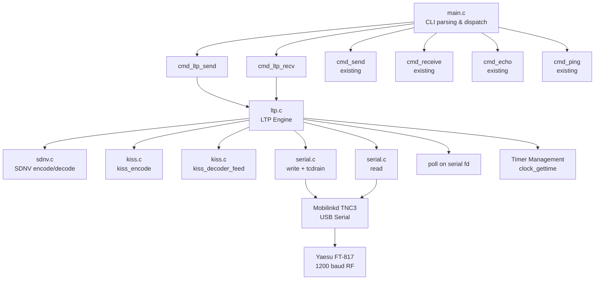
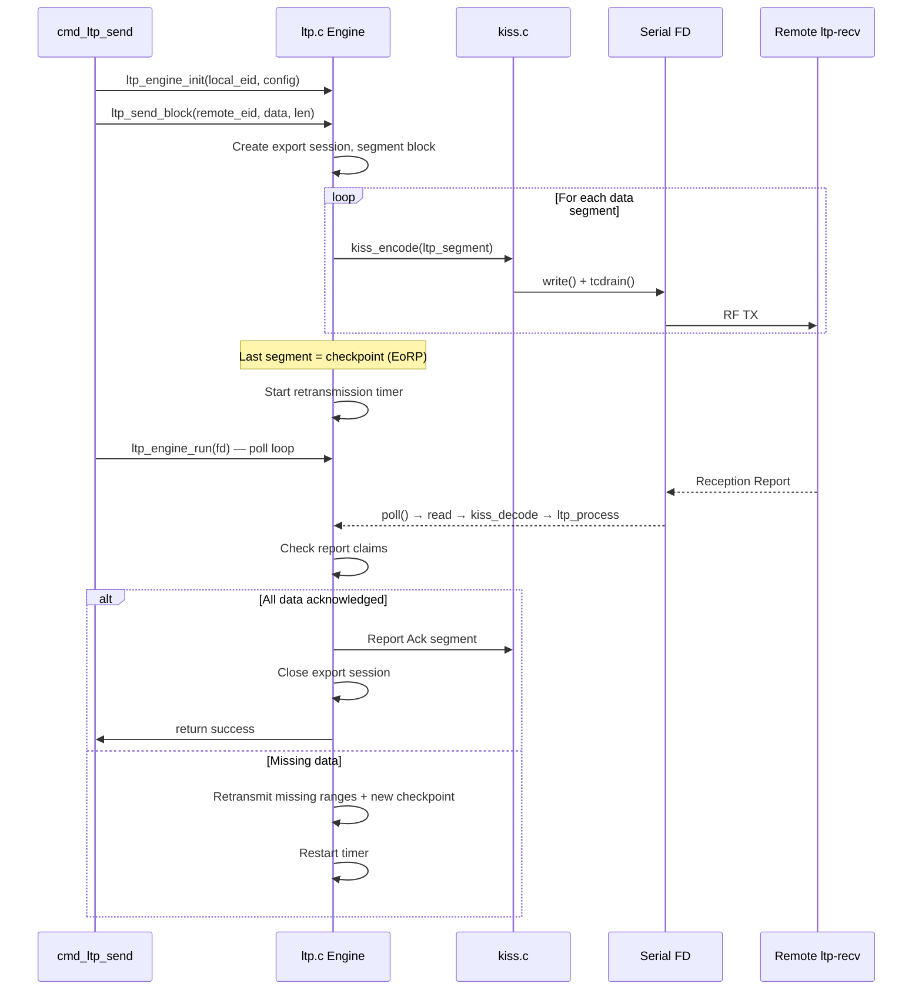
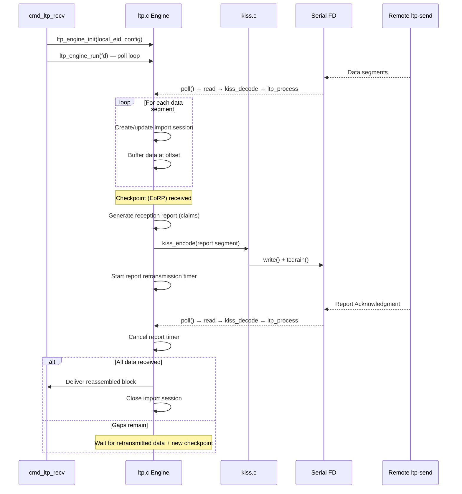
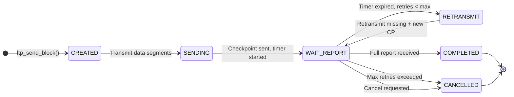
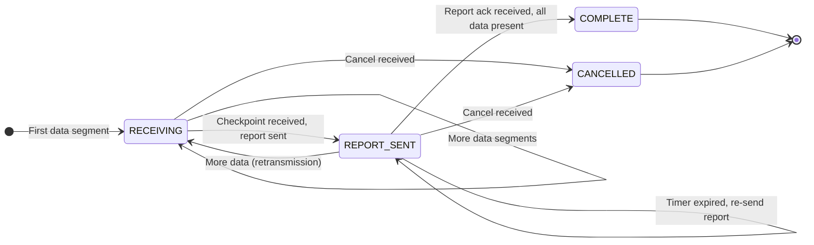

# Design Document: LTP over KISS

## Overview

This feature adds the Licklider Transmission Protocol (LTP) to the existing `kiss_interface` tool, enabling reliable data transfer over 1200 baud amateur radio links. LTP segments are encapsulated directly in KISS frames, bypassing the AX.25 layer entirely. Two new CLI subcommands — `ltp-send` and `ltp-recv` — provide reliable block transfer with checkpoint/report acknowledgment, retransmission timers, and session management.

The implementation adds three new compilation units (`sdnv.c`, `ltp.c`, and extensions to `main.c`) while reusing `kiss.c` and `serial.c` unchanged. The architecture follows the same single-threaded, `poll()`-based event loop pattern established by `cmd_ping`, extended with timer management for LTP retransmissions.

### Key Design Decisions

- **No AX.25 layer**: LTP segments go directly into KISS frames. This eliminates the 16-byte AX.25 header overhead, which is significant at 64-byte segment MTU. DTN endpoint IDs replace callsign-based addressing.
- **Static allocation only**: All session tables, reassembly buffers, and timer arrays are statically sized with compile-time maximums (128 sessions, 1024-byte max block). No `malloc`/`free` anywhere.
- **SDNV as separate module**: Self-Delimiting Numeric Values are used throughout LTP headers. Isolating SDNV encode/decode in `sdnv.h`/`sdnv.c` enables independent testing and reuse for future Bundle Protocol work.
- **Simplified LTP subset**: No extensions, no green-part-only transfers in the initial implementation. All data is red-part (reliable). Green-part support is limited to segment type recognition for forward compatibility.
- **Engine ID from callsign hash**: DTN endpoint identifiers like `dtn://g4dpz-1` are mapped to numeric engine IDs using a simple deterministic hash of the callsign portion. This avoids a configuration file while remaining consistent across runs.
- **Timer wheel via sorted expiry scan**: With at most ~128 active timers, a linear scan of the timer array on each `poll()` wakeup is sufficient. The `poll()` timeout is set to the minimum time-to-next-expiry.
- **64-byte segment MTU default**: At 1200 baud, a 64-byte payload takes ~530ms to transmit. With KISS framing overhead and byte-stuffing, worst-case KISS frame stays well under the 512-byte TNC buffer limit.

## Architecture



### Module Responsibilities

| Module | Responsibility |
|--------|---------------|
| `main.c` | CLI argument parsing (extended for `ltp-send`, `ltp-recv`), mode dispatch, signal handling |
| `ltp.h` / `ltp.c` | LTP segment encoding/decoding, session management (export/import tables), checkpoint/report logic, retransmission timers, block segmentation/reassembly, cancel handling, event loop |
| `sdnv.h` / `sdnv.c` | SDNV encoding and decoding of variable-length integers |
| `kiss.h` / `kiss.c` | KISS frame encoding/decoding (unchanged) |
| `serial.h` / `serial.c` | Serial port open/close/configure (unchanged) |

### LTP Send Sequence



### LTP Receive Sequence



## Components and Interfaces

### sdnv.h

```c
#ifndef SDNV_H
#define SDNV_H

#include <stdint.h>
#include <stddef.h>

#define SDNV_MAX_BYTES 10  /* Max bytes for values up to 2^63-1 */

/* Encode a non-negative value into SDNV format.
 * out must be at least SDNV_MAX_BYTES.
 * Returns number of bytes written, or -1 on error (value too large). */
int sdnv_encode(uint64_t value, uint8_t *out, size_t out_size);

/* Decode an SDNV from a buffer.
 * Returns number of bytes consumed, or -1 on error (truncated/overflow).
 * Sets *value on success. */
int sdnv_decode(const uint8_t *buf, size_t buf_len, uint64_t *value);

#endif
```

### ltp.h

```c
#ifndef LTP_H
#define LTP_H

#include <stdint.h>
#include <stddef.h>
#include <time.h>

/* ---- Configuration constants ---- */
#define LTP_MAX_EXPORT_SESSIONS  128
#define LTP_MAX_IMPORT_SESSIONS  128
#define LTP_MAX_BLOCK_SIZE       1024
#define LTP_DEFAULT_SEGMENT_MTU  64
#define LTP_DEFAULT_OWLT_MS      1500
#define LTP_DEFAULT_MAX_RETRIES  7
#define LTP_MAX_CLAIMS           16   /* Max reception report claims */
#define LTP_MAX_TIMERS           256  /* Max concurrent timers */
#define LTP_MAX_SEGMENT_BUF      512  /* Max encoded segment size */
#define LTP_MAX_ENDPOINTS        8    /* Max endpoint mappings */

/* ---- LTP Segment Types (RFC 5326 §3.1) ---- */
typedef enum {
    LTP_SEG_RED_DATA          = 0,   /* Red data, no checkpoint */
    LTP_SEG_RED_DATA_CP       = 1,   /* Red data with checkpoint */
    LTP_SEG_RED_DATA_EORP_CP  = 2,   /* Red data, end-of-red-part + checkpoint */
    LTP_SEG_GREEN_DATA        = 3,   /* Green data */
    LTP_SEG_GREEN_DATA_EOB    = 4,   /* Green data, end-of-block */
    /* 5-7 reserved */
    LTP_SEG_REPORT            = 8,   /* Reception report */
    LTP_SEG_REPORT_ACK        = 9,   /* Report acknowledgment */
    /* 10-11 reserved */
    LTP_SEG_CANCEL_BY_SENDER  = 12,  /* Cancel from sender */
    LTP_SEG_CANCEL_ACK_SENDER = 13,  /* Cancel ack to sender */
    LTP_SEG_CANCEL_BY_RECVR   = 14,  /* Cancel from receiver */
    LTP_SEG_CANCEL_ACK_RECVR  = 15   /* Cancel ack to receiver */
} ltp_seg_type_t;

/* ---- LTP Segment Header ---- */
typedef struct {
    uint8_t        version;          /* Protocol version (0) */
    ltp_seg_type_t type;             /* Segment type (4 bits) */
    uint64_t       sender_engine_id; /* Session originator engine ID */
    uint64_t       session_number;   /* Session number */
    uint8_t        hdr_ext_count;    /* Header extension count (0) */
    uint8_t        trailer_ext_count;/* Trailer extension count (0) */
} ltp_segment_hdr_t;

/* ---- Data Segment Content ---- */
typedef struct {
    ltp_segment_hdr_t hdr;
    uint64_t          client_svc_id;   /* Client service ID */
    uint64_t          offset;          /* Data offset within block */
    uint64_t          length;          /* Data length */
    uint64_t          cp_serial;       /* Checkpoint serial (if CP) */
    uint64_t          rpt_serial;      /* Report serial (if CP) */
    const uint8_t    *data;            /* Pointer to payload data */
} ltp_data_segment_t;

/* ---- Reception Report Claim ---- */
typedef struct {
    uint64_t offset;
    uint64_t length;
} ltp_claim_t;

/* ---- Reception Report Segment ---- */
typedef struct {
    ltp_segment_hdr_t hdr;
    uint64_t          rpt_serial;
    uint64_t          cp_serial;
    uint64_t          upper_bound;
    uint64_t          lower_bound;
    uint32_t          claim_count;
    ltp_claim_t       claims[LTP_MAX_CLAIMS];
} ltp_report_segment_t;

/* ---- Report Acknowledgment Segment ---- */
typedef struct {
    ltp_segment_hdr_t hdr;
    uint64_t          rpt_serial;
} ltp_report_ack_segment_t;

/* ---- Cancel Segment ---- */
typedef struct {
    ltp_segment_hdr_t hdr;
    uint8_t           reason;  /* Cancel reason code */
} ltp_cancel_segment_t;

/* ---- Timer Entry ---- */
typedef struct {
    int      active;
    int      type;              /* 0=checkpoint, 1=report, 2=cancel */
    uint64_t session_engine_id;
    uint64_t session_number;
    uint64_t serial;            /* CP or report serial */
    int      retries;
    struct timespec expiry;
} ltp_timer_t;

/* ---- Receive Bitmap (tracks received byte ranges) ---- */
typedef struct {
    uint32_t claim_count;
    ltp_claim_t claims[LTP_MAX_CLAIMS];
} ltp_recv_map_t;

/* ---- Export Session ---- */
typedef struct {
    int      active;
    uint64_t engine_id;         /* Local engine ID (session originator) */
    uint64_t session_number;
    uint64_t remote_engine_id;
    uint8_t  block_data[LTP_MAX_BLOCK_SIZE];
    uint32_t block_len;
    uint32_t segment_mtu;
    uint64_t next_cp_serial;
    int      completed;         /* All data acknowledged */
    int      cancelled;
} ltp_export_session_t;

/* ---- Import Session ---- */
typedef struct {
    int      active;
    uint64_t engine_id;         /* Remote engine ID (session originator) */
    uint64_t session_number;
    uint8_t  block_data[LTP_MAX_BLOCK_SIZE];
    uint32_t block_len;         /* Expected total (from EoRP offset+len) */
    ltp_recv_map_t recv_map;
    uint64_t next_rpt_serial;
    int      complete;          /* All data received */
    int      delivered;
} ltp_import_session_t;

/* ---- Endpoint Mapping ---- */
typedef struct {
    char     eid[64];           /* e.g. "dtn://g4dpz-1" */
    uint64_t engine_id;
} ltp_endpoint_t;

/* ---- Engine Configuration ---- */
typedef struct {
    uint32_t segment_mtu;       /* Max data payload per segment */
    uint32_t owlt_ms;           /* One-way light time estimate (ms) */
    uint32_t max_retries;       /* Max retransmission attempts */
    uint32_t max_block_size;    /* Max block size */
    int      verbose;
} ltp_config_t;

/* ---- LTP Engine ---- */
typedef struct {
    ltp_config_t         config;
    uint64_t             local_engine_id;
    char                 local_eid[64];
    uint64_t             next_session_number;

    ltp_export_session_t export_sessions[LTP_MAX_EXPORT_SESSIONS];
    ltp_import_session_t import_sessions[LTP_MAX_IMPORT_SESSIONS];
    ltp_timer_t          timers[LTP_MAX_TIMERS];
    ltp_endpoint_t       endpoints[LTP_MAX_ENDPOINTS];
    uint32_t             endpoint_count;

    /* Callback for delivered blocks */
    void (*on_block_received)(const uint8_t *data, uint32_t len,
                              uint64_t remote_engine_id, void *ctx);
    void *cb_ctx;

    /* Statistics */
    uint32_t segments_sent;
    uint32_t segments_received;
    uint32_t blocks_delivered;
    uint32_t sessions_completed;
    uint32_t sessions_cancelled;
} ltp_engine_t;

/* ---- Engine Lifecycle ---- */
int  ltp_engine_init(ltp_engine_t *eng, const char *local_eid,
                     const ltp_config_t *config);

/* ---- Block Transmission ---- */
int  ltp_send_block(ltp_engine_t *eng, int fd,
                    const char *remote_eid,
                    const uint8_t *data, uint32_t len);

/* ---- Segment Processing (called when KISS delivers a payload) ---- */
int  ltp_process_segment(ltp_engine_t *eng, int fd,
                         const uint8_t *buf, size_t len);

/* ---- Timer Management ---- */
int  ltp_get_next_timeout_ms(const ltp_engine_t *eng);
int  ltp_fire_expired_timers(ltp_engine_t *eng, int fd);

/* ---- Event Loop (runs until session completes or signal) ---- */
int  ltp_engine_run(ltp_engine_t *eng, int fd, int send_mode);

/* ---- Session Cancellation ---- */
int  ltp_cancel_session(ltp_engine_t *eng, int fd,
                        uint64_t session_number);

/* ---- Endpoint Mapping ---- */
uint64_t ltp_eid_to_engine_id(const char *eid);
int      ltp_register_endpoint(ltp_engine_t *eng, const char *eid);

/* ---- Segment Encoding/Decoding ---- */
int  ltp_encode_data_segment(const ltp_data_segment_t *seg,
                             uint8_t *out, size_t out_size);
int  ltp_decode_segment(const uint8_t *buf, size_t len,
                        ltp_segment_hdr_t *hdr,
                        uint8_t *body, size_t body_size,
                        size_t *body_len);
int  ltp_encode_report(const ltp_report_segment_t *rpt,
                       uint8_t *out, size_t out_size);
int  ltp_encode_report_ack(const ltp_report_ack_segment_t *ack,
                           uint8_t *out, size_t out_size);
int  ltp_encode_cancel(const ltp_cancel_segment_t *cancel,
                       uint8_t *out, size_t out_size);
```

### main.c Extensions

```c
/* New mode enum values */
typedef enum {
    CMD_MODE_NONE,
    CMD_MODE_SEND,
    CMD_MODE_RECEIVE,
    CMD_MODE_ECHO,
    CMD_MODE_PING,
    CMD_MODE_LTP_SEND,    /* NEW */
    CMD_MODE_LTP_RECV     /* NEW */
} cmd_mode_t;

/* Extended cli_args_t fields */
typedef struct {
    /* ... existing fields ... */
    const char *local_eid;   /* DTN endpoint, e.g. "dtn://g4dpz-1" */
    const char *remote_eid;  /* Remote DTN endpoint */
    int         mtu;         /* LTP segment MTU (default 64) */
    int         owlt_ms;     /* One-way light time (default 1500) */
    int         retries;     /* Max retransmission attempts (default 7) */
    cmd_mode_t  mode;
} cli_args_t;

/* New command functions */
int cmd_ltp_send(int fd, const char *local_eid, const char *remote_eid,
                 const char *payload, const ltp_config_t *config);
int cmd_ltp_recv(int fd, const char *local_eid,
                 const ltp_config_t *config);
```

### Existing Interfaces (unchanged)

- `kiss.h` — `kiss_encode()`, `kiss_decoder_feed()`, `kiss_decoder_init()`
- `serial.h` — `serial_open()`, `serial_close()`, `serial_configure_tnc()`, `serial_parse_device()`

## Data Models

### SDNV Encoding Format

Self-Delimiting Numeric Values encode non-negative integers using 7 data bits per byte, with the MSB as a continuation bit (1 = more bytes follow, 0 = last byte). Most significant byte first.

```
Value 0:       [0x00]                    (1 byte)
Value 127:     [0x7F]                    (1 byte)
Value 128:     [0x81, 0x00]              (2 bytes)
Value 16383:   [0xFF, 0x7F]              (2 bytes)
Value 16384:   [0x81, 0x80, 0x00]        (3 bytes)
```

Maximum encoded length: 10 bytes (for values up to 2^63 - 1).

### LTP Segment Wire Format

```
LTP Segment Header:
┌─────────────────────────────────────────────────────┐
│ Byte 0: Version (4 bits) | Type (4 bits)            │
│ SDNV:   Session Originator Engine ID                │
│ SDNV:   Session Number                              │
│ Byte:   Header Extension Count (0)                  │
│ Byte:   Trailer Extension Count (0)                 │
├─────────────────────────────────────────────────────┤
│ Segment-type-specific content (see below)           │
└─────────────────────────────────────────────────────┘

Data Segment Content (types 0-4):
┌─────────────────────────────────────────────────────┐
│ SDNV: Client Service ID                             │
│ SDNV: Offset within block                           │
│ SDNV: Data length                                   │
│ [If checkpoint: SDNV: Checkpoint Serial Number]     │
│ [If checkpoint: SDNV: Report Serial Number (0)]     │
│ Data bytes (length bytes)                           │
└─────────────────────────────────────────────────────┘

Reception Report Content (type 8):
┌─────────────────────────────────────────────────────┐
│ SDNV: Report Serial Number                          │
│ SDNV: Checkpoint Serial Number (being responded to) │
│ SDNV: Upper Bound (highest byte offset + 1)         │
│ SDNV: Lower Bound (lowest byte offset)              │
│ SDNV: Reception Claim Count                         │
│ For each claim:                                     │
│   SDNV: Claim Offset (relative to lower bound)      │
│   SDNV: Claim Length                                │
└─────────────────────────────────────────────────────┘

Report Acknowledgment Content (type 9):
┌─────────────────────────────────────────────────────┐
│ SDNV: Report Serial Number                          │
└─────────────────────────────────────────────────────┘

Cancel Segment Content (types 12-15):
┌─────────────────────────────────────────────────────┐
│ Byte: Reason Code                                   │
└─────────────────────────────────────────────────────┘
```

### Frame Nesting (LTP over KISS)

```
KISS Frame:
┌──────┬──────┬─────────────────────────────────┬──────┐
│ FEND │ 0x00 │ LTP Segment (byte-stuffed)      │ FEND │
└──────┴──────┴─────────────────────────────────┴──────┘

No AX.25 header — LTP segment is the direct KISS payload.
```

### Session State Machines





### Engine ID Derivation

DTN endpoint identifiers are mapped to numeric engine IDs using a simple DJB2 hash of the callsign portion:

```c
/* Extract callsign from "dtn://callsign", hash to uint64_t */
uint64_t ltp_eid_to_engine_id(const char *eid) {
    const char *callsign = eid;
    if (strncmp(eid, "dtn://", 6) == 0)
        callsign = eid + 6;
    uint64_t hash = 5381;
    for (const char *p = callsign; *p; p++)
        hash = ((hash << 5) + hash) + (uint8_t)*p;  /* hash * 33 + c */
    return hash;
}
```

### Timer Computation

Retransmission timer duration = `2 × OWLT + margin`, where margin is a fixed 200ms processing allowance:

```
timer_ms = 2 * owlt_ms + 200
```

With default OWLT of 1500ms: timer = 3200ms.

The `poll()` timeout is computed as:

```
timeout = min(timer.expiry - now) for all active timers
        = -1 if no active timers (receive mode, block indefinitely)
```

### Configuration Defaults

| Parameter | Default | CLI Flag | Range |
|-----------|---------|----------|-------|
| Segment MTU | 64 bytes | `--mtu` | 16–256 |
| OWLT | 1500 ms | `--owlt` | 100–30000 |
| Max retries | 7 | `--retries` | 1–50 |
| Max block size | 1024 bytes | compile-time | — |
| Max export sessions | 128 | compile-time | — |
| Max import sessions | 128 | compile-time | — |
| TX-delay | 500 ms | `--txdelay` | 0–2550 |
| TX-tail | 300 ms | `--txtail` | 0–2550 |

## Correctness Properties

*A property is a characteristic or behavior that should hold true across all valid executions of a system — essentially, a formal statement about what the system should do. Properties serve as the bridge between human-readable specifications and machine-verifiable correctness guarantees.*

### Property 1: SDNV encode/decode round-trip

*For any* non-negative integer value in the range 0 to 2^63 - 1, encoding it with `sdnv_encode` and then decoding the resulting bytes with `sdnv_decode` SHALL produce the original value, and the number of bytes consumed by decode SHALL equal the number of bytes produced by encode.

**Validates: Requirements 1.3, 13.1, 13.2, 13.3**

### Property 2: SDNV encoding structural invariant

*For any* non-negative integer value in the range 0 to 2^63 - 1, the SDNV encoding SHALL have the continuation bit (MSB) set to 1 on all bytes except the last byte, which SHALL have the continuation bit set to 0. The encoding SHALL be at most 10 bytes long.

**Validates: Requirements 13.1, 13.4**

### Property 3: LTP data segment encode/decode round-trip

*For any* valid LTP data segment (with segment type in {0,1,2,3,4}, engine IDs in [0, 2^63-1], session number in [0, 2^63-1], valid offset/length, and payload of 0 to 256 bytes), encoding with `ltp_encode_data_segment` and then decoding with `ltp_decode_segment` SHALL produce a segment with identical type, engine IDs, session number, offset, length, checkpoint serial (if applicable), and payload data.

**Validates: Requirements 1.1, 1.2, 1.7, 2.1**

### Property 4: LTP control segment encode/decode round-trip

*For any* valid LTP control segment (reception report with 0 to 16 claims, report acknowledgment, cancel-by-sender, cancel-by-receiver, cancel acknowledgments), encoding and then decoding SHALL produce an equivalent segment structure with identical fields.

**Validates: Requirements 1.7, 2.2**

### Property 5: Block segmentation completeness

*For any* data block of size 1 to 1024 bytes and any segment MTU in the range 16 to 256, segmenting the block SHALL produce ceil(block_len / mtu) segments where: each segment's data length is at most the MTU, the segments' (offset, length) ranges cover [0, block_len) without gaps or overlaps, and the final segment has type LTP_SEG_RED_DATA_EORP_CP with a non-zero checkpoint serial number.

**Validates: Requirements 3.1, 4.1, 6.1**

### Property 6: Block segmentation/reassembly round-trip

*For any* data block of size 1 to 1024 bytes, segmenting the block into LTP data segments and then feeding all segments (in any order) to an import session's reassembly logic SHALL produce a reassembled block identical to the original.

**Validates: Requirements 3.5, 6.2, 6.3**

### Property 7: Reception report claims accuracy

*For any* block of size N and any subset of data segments from that block (simulating partial reception), the reception report generated upon checkpoint receipt SHALL contain claims whose union exactly equals the set of byte ranges that were received, with no gaps within contiguous received regions and no claims for unreceived data.

**Validates: Requirements 4.2**

### Property 8: Retransmission targets exactly missing ranges

*For any* block and any reception report indicating gaps, the retransmitted segments SHALL cover exactly the byte ranges NOT covered by the report's claims, with each retransmitted segment's payload at most the configured MTU.

**Validates: Requirements 4.4**

### Property 9: Session serial numbers are monotonically increasing

*For any* sequence of checkpoint transmissions within an export session, the checkpoint serial numbers SHALL be strictly monotonically increasing. Similarly, *for any* sequence of report transmissions within an import session, the report serial numbers SHALL be strictly monotonically increasing.

**Validates: Requirements 4.6, 4.7**

### Property 10: Engine ID hash determinism

*For any* DTN endpoint identifier string, calling `ltp_eid_to_engine_id` twice with the same string SHALL produce the same numeric engine ID. Additionally, *for any* two distinct callsign strings, the probability of hash collision SHALL be low (verified by testing with a large sample of random strings and checking for no collisions within the sample).

**Validates: Requirements 8.2**

### Property 11: KISS frame size limit for LTP segments

*For any* LTP segment with data payload at the configured segment MTU (default 64 bytes), the KISS-encoded frame (including FEND delimiters, command byte, and worst-case byte-stuffing) SHALL NOT exceed 512 bytes.

**Validates: Requirements 9.5**

## Error Handling

| Condition | Behavior |
|-----------|----------|
| SDNV value > 2^63 - 1 | `sdnv_encode` returns -1 |
| SDNV truncated in buffer | `sdnv_decode` returns -1 |
| LTP segment with unrecognized type (5-7, 10-11) | Discard segment, log warning (verbose) |
| LTP segment with non-matching destination engine ID | Discard segment, log warning (verbose) |
| Segment offset + length exceeds max block size | Discard segment, log warning |
| Max export sessions reached | `ltp_send_block` returns -1 |
| Max import sessions reached | Discard incoming segment for new session, log warning |
| Retransmission attempts exhausted | Cancel session, notify application, `cmd_ltp_send` exits with code 1 |
| Block size exceeds LTP_MAX_BLOCK_SIZE | `ltp_send_block` returns -1 |
| Empty payload for ltp-send | Print error to stderr, exit with code 1 |
| Missing --device, --local, or --remote | Print specific error to stderr, exit with code 1 |
| Serial port open failure | Print error to stderr, exit with code 1 |
| Serial write failure (not EINTR) | Log error, cancel active sessions, exit with code 1 |
| Serial read failure (not EINTR) | Log error, exit event loop |
| poll() error (not EINTR) | Log error, exit event loop |
| KISS decode error (overflow, non-data) | Discard frame, continue |
| SIGINT / SIGTERM | Set `g_running = 0`, exit event loop cleanly, print summary |
| Cancel segment received for unknown session | Send cancel ack, ignore |
| Report for unknown export session | Discard, log warning |
| Report ack for unknown import session | Discard, log warning |

### Signal Handling

Reuses the existing `g_running` flag and `sigaction()` setup from `main.c`. The LTP event loop checks `g_running` on each `poll()` iteration. When interrupted, active sessions are abandoned (no cancel segments sent — the remote side will time out), and a summary is printed.

## Testing Strategy

### Property-Based Tests (using [theft](https://github.com/silentbicycle/theft) — C PBT library)

Each property test runs a minimum of 100 trials (configured for 1000). If `theft` is not available, tests fall back to a hand-rolled random loop using `rand()`/`srand(time(NULL))` with 1000 iterations, consistent with the existing test pattern.

| Test File | Test | Property | Iterations |
|-----------|------|----------|------------|
| `test_sdnv.c` | `test_sdnv_roundtrip` | Property 1: SDNV encode/decode round-trip | 1000 |
| `test_sdnv.c` | `test_sdnv_structure` | Property 2: SDNV encoding structural invariant | 1000 |
| `test_ltp.c` | `test_ltp_data_segment_roundtrip` | Property 3: LTP data segment round-trip | 1000 |
| `test_ltp.c` | `test_ltp_control_segment_roundtrip` | Property 4: LTP control segment round-trip | 1000 |
| `test_ltp.c` | `test_block_segmentation_completeness` | Property 5: Block segmentation completeness | 1000 |
| `test_ltp.c` | `test_block_segmentation_reassembly_roundtrip` | Property 6: Block segmentation/reassembly round-trip | 1000 |
| `test_ltp.c` | `test_reception_report_claims_accuracy` | Property 7: Reception report claims accuracy | 1000 |
| `test_ltp.c` | `test_retransmission_targets_missing` | Property 8: Retransmission targets missing ranges | 1000 |
| `test_ltp.c` | `test_serial_numbers_monotonic` | Property 9: Serial numbers monotonically increasing | 1000 |
| `test_ltp.c` | `test_engine_id_determinism` | Property 10: Engine ID hash determinism | 1000 |
| `test_ltp.c` | `test_kiss_frame_size_limit` | Property 11: KISS frame size limit | 1000 |

Each test is tagged with: `/* Feature: ltp-over-kiss, Property N: <title> */`

### Unit Tests (example-based)

| Test File | Test | Validates |
|-----------|------|-----------|
| `test_sdnv.c` | SDNV encode 0 → `[0x00]` | Req 13.1 |
| `test_sdnv.c` | SDNV encode 127 → `[0x7F]` | Req 13.1 |
| `test_sdnv.c` | SDNV encode 128 → `[0x81, 0x00]` | Req 13.1 |
| `test_sdnv.c` | SDNV encode 2^63-1 → 10 bytes | Req 13.1 |
| `test_sdnv.c` | SDNV decode truncated buffer returns -1 | Req 13.5 |
| `test_sdnv.c` | SDNV encode with out_size=0 returns -1 | Defensive |
| `test_ltp.c` | Decode segment with invalid type (5) returns error | Req 2.3 |
| `test_ltp.c` | Segment with offset+length > block size discarded | Req 6.5 |
| `test_ltp.c` | Max export sessions enforced (129th rejected) | Req 3.6, 3.8 |
| `test_ltp.c` | Max import sessions enforced (129th rejected) | Req 3.7 |
| `test_ltp.c` | Export session closed after full report | Req 3.4 |
| `test_ltp.c` | Import session delivers block and closes | Req 3.5 |
| `test_ltp.c` | Report ack generated on report receipt | Req 4.3 |
| `test_ltp.c` | Report ack cancels report timer | Req 4.5 |
| `test_ltp.c` | Timer duration = 2*OWLT + 200ms | Req 5.1 |
| `test_ltp.c` | Session cancelled after max retries | Req 5.5, 5.6 |
| `test_ltp.c` | Cancel-by-sender triggers cancel ack | Req 7.2 |
| `test_ltp.c` | Cancel-by-receiver triggers cancel ack | Req 7.4 |
| `test_ltp.c` | Engine ID for "dtn://g4dpz-1" is consistent | Req 8.2 |
| `test_ltp.c` | Segment with wrong engine ID discarded | Req 8.5 |
| `test_ltp.c` | 1024-byte block accepted | Req 6.4 |
| `test_ltp.c` | 1025-byte block rejected | Req 6.4 |
| `test_cli.c` | CLI parses `ltp-send` subcommand with all args | Req 10.1, 10.2 |
| `test_cli.c` | CLI parses `ltp-recv` subcommand with all args | Req 11.1, 11.2 |
| `test_cli.c` | CLI defaults: mtu=64, owlt=1500, retries=7 | Req 10.2 |
| `test_cli.c` | Missing --local for ltp-send prints error | Req 10.1 |
| `test_cli.c` | Existing send/receive/echo/ping commands still parse | Req 14.1 |

### Integration Tests (manual, with hardware)

| Test | Validates |
|------|-----------|
| ltp-send a short message, ltp-recv on second station | Req 3.1, 3.5, 9.1, 10.3, 10.4 |
| ltp-send a 1024-byte block, verify reassembly | Req 6.1, 6.3 |
| Simulate packet loss (disconnect briefly), verify retransmission | Req 4.4, 5.1, 5.2 |
| ltp-send with --verbose, verify segment-level output | Req 10.6 |
| ltp-recv with --verbose, verify segment-level output | Req 11.6 |
| Ctrl-C during ltp-recv, verify summary and exit 0 | Req 11.4, 11.5, 12.5 |
| Exhaust retransmissions, verify error exit | Req 5.6, 10.5 |
| Run existing `send`/`receive`/`echo`/`ping` after adding LTP | Req 14.1 |
| Verify KISS frames stay under 512 bytes on wire (logic analyzer) | Req 9.5 |

### Build Integration

New Makefile targets:

```makefile
# Updated source list
SRC = main.c kiss.c ax25.c serial.c ping.c ltp.c sdnv.c
OBJ = $(SRC:.c=.o)

# New test targets
test_sdnv: test_sdnv.c sdnv.c
	$(CC) $(CFLAGS) -o $@ $^ $(THEFT_FLAGS)

test_ltp: test_ltp.c ltp.c sdnv.c kiss.c
	$(CC) $(CFLAGS) -o $@ $^ $(THEFT_FLAGS)

# Updated CLI test
test_cli: test_cli.c main.c kiss.c ax25.c serial.c ping.c ltp.c sdnv.c
	$(CC) $(CFLAGS) -DTEST_CLI_MODE -o $@ $^

# Updated test target
test: test_kiss test_ax25 test_serial test_cli test_ping test_sdnv test_ltp
	./test_kiss
	./test_ax25
	./test_serial
	./test_cli
	./test_ping
	./test_sdnv
	./test_ltp
```
