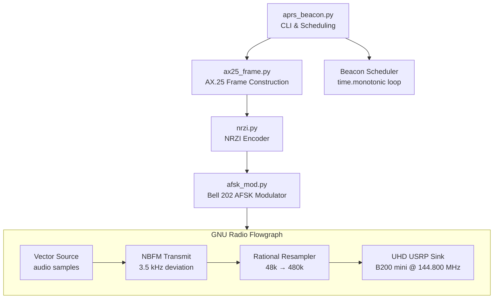
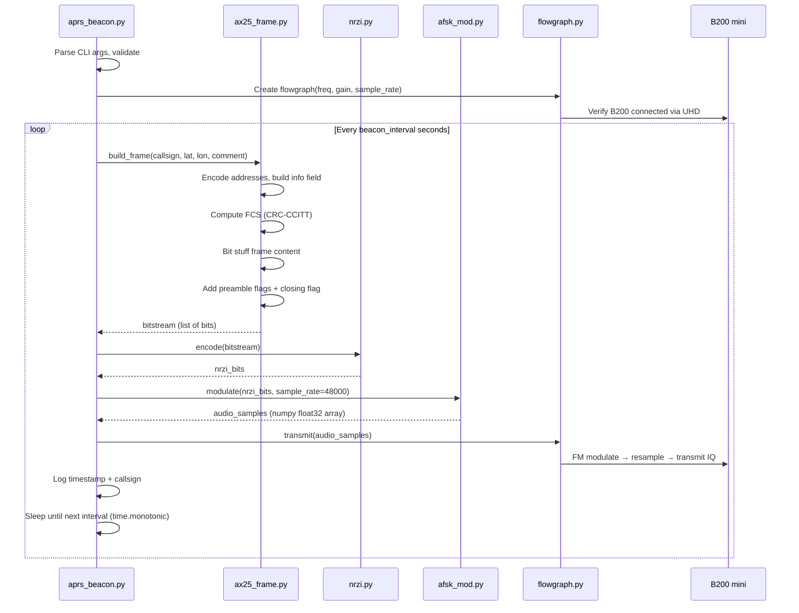

# Design Document: GNU Radio APRS Beacon

## Overview

This feature implements a software-defined APRS beacon transmitter using GNU Radio and an Ettus B200 mini SDR, replacing the Mobilinkd TNC3 hardware path for beacon transmission. The system constructs AX.25 UI frames with APRS position reports in Python, applies NRZI encoding, generates Bell 202 AFSK audio (1200 baud, 1200 Hz mark / 2200 Hz space), FM-modulates the baseband, and transmits on 144.850 MHz via the UHD sink.

The implementation lives in a new `gnuradio/` directory, completely separate from the existing C codebase in `kiss-interface/`. The C reference implementations of AX.25 framing (`ax25.c`) and beacon construction (`beacon.c`) inform the Python design but are not called at runtime.

### Key Design Decisions

- **Pure Python AX.25 framing**: The AX.25 frame construction (address encoding, FCS, bit stuffing, flags) is reimplemented in Python rather than calling the C code via FFI. This keeps the GNU Radio pipeline self-contained with no C build dependency, and the C code serves as a verified reference for correctness testing.
- **GNU Radio flowgraph for signal path only**: The flowgraph handles AFSK generation → FM modulation → UHD sink. Frame construction and scheduling happen in Python outside the flowgraph, feeding completed audio bursts into the signal chain.
- **Continuous-phase AFSK via phase accumulator**: Rather than switching between two independent oscillators, a single phase accumulator tracks the instantaneous frequency, ensuring zero-discontinuity tone transitions as required by Bell 202.
- **Pre-computed audio bursts**: Each beacon frame is fully rendered to an audio sample array before injection into the flowgraph. This avoids real-time scheduling complexity and ensures deterministic bit timing.
- **Rational sample rate chain**: Audio at 48 kHz (integer multiple of 1200 baud = 40 samples/bit), rational resampled to the SDR sample rate (default 480 kHz, ratio 10:1). This keeps AFSK generation simple with exact integer samples per bit.
- **Band-limited transmission**: The configured frequency is validated against the 2-metre amateur band (144.000–146.000 MHz) before the flowgraph starts, satisfying OFCOM regulatory requirements.
- **TOCALL "APZ001"**: Consistent with the existing C beacon, uses the experimental APRS software TOCALL from the APRS TOCALL registry.

## Architecture



### Module Responsibilities

| Module | Responsibility |
|--------|---------------|
| `aprs_beacon.py` | CLI argument parsing, beacon scheduling loop, signal handling, top-level orchestration |
| `ax25_frame.py` | AX.25 address encoding, UI frame construction, CRC-CCITT FCS, bit stuffing, flag framing |
| `nrzi.py` | NRZI encoding of bit-stuffed AX.25 bitstream |
| `afsk_mod.py` | Bell 202 AFSK audio generation with continuous-phase synthesis |
| `flowgraph.py` | GNU Radio flowgraph setup: vector source → NBFM TX → rational resampler → UHD sink |

### Beacon Transmission Sequence




## Components and Interfaces

### ax25_frame.py

```python
"""AX.25 UI frame construction for APRS beacons.

Implements address encoding, APRS position formatting, CRC-CCITT FCS,
bit stuffing, and flag framing. Pure Python, no external dependencies.
Reference: kiss-interface/ax25.c, kiss-interface/beacon.c
"""

AX25_ADDR_LEN = 7
AX25_CTRL_UI = 0x03
AX25_PID_NOLAYER3 = 0xF0
TOCALL = "APZ001"
CRC_POLY = 0x8408       # CRC-CCITT reflected polynomial
CRC_INIT = 0xFFFF
PREAMBLE_FLAGS = 25      # Minimum preamble 0x7E count
FLAG = 0x7E


def encode_address(callsign: str, last: bool) -> bytes:
    """Encode callsign-SSID into 7-byte AX.25 address field.

    Args:
        callsign: Callsign string, e.g. "G4DPZ" or "G4DPZ-1".
        last: True if this is the final address field (sets extension bit).

    Returns:
        7-byte address field.

    Raises:
        ValueError: If callsign is invalid.
    """
    ...


def format_latitude(lat: float) -> str:
    """Format decimal degrees latitude to APRS DDMM.MMN string.

    Args:
        lat: Latitude in decimal degrees, -90.0 to +90.0.

    Returns:
        8-character string, e.g. "5228.02N".

    Raises:
        ValueError: If latitude is out of range.
    """
    ...


def format_longitude(lon: float) -> str:
    """Format decimal degrees longitude to APRS DDDMM.MMW string.

    Args:
        lon: Longitude in decimal degrees, -180.0 to +180.0.

    Returns:
        9-character string, e.g. "00201.32W".

    Raises:
        ValueError: If longitude is out of range.
    """
    ...


def build_info_field(lat: float, lon: float, comment: str = "") -> bytes:
    """Build APRS position info field.

    Format: !DDMM.MMN/DDDMM.MMW-comment

    Returns:
        Info field as bytes.
    """
    ...


def compute_fcs(data: bytes) -> int:
    """Compute CRC-CCITT FCS over data.

    Uses polynomial 0x8408 (reflected), initial value 0xFFFF.
    Returns 16-bit FCS value.
    """
    ...


def bytes_to_bits(data: bytes) -> list[int]:
    """Convert bytes to list of bits, LSB first per byte."""
    ...


def bit_stuff(bits: list[int]) -> list[int]:
    """Apply AX.25 bit stuffing: insert 0 after five consecutive 1s."""
    ...


def build_frame(src_callsign: str, lat: float, lon: float,
                comment: str = "") -> list[int]:
    """Build complete AX.25 UI frame as a bitstream with flags.

    Constructs address fields, info field, FCS, applies bit stuffing,
    and wraps with preamble flags and closing flag.

    Args:
        src_callsign: Source callsign-SSID.
        lat: Latitude in decimal degrees.
        lon: Longitude in decimal degrees.
        comment: APRS comment string.

    Returns:
        List of bits (0/1 integers) representing the complete frame.

    Raises:
        ValueError: If any input is invalid.
    """
    ...
```

### nrzi.py

```python
"""NRZI encoder for AX.25 AFSK transmission.

In NRZI encoding:
- A 0 bit causes a tone transition (toggle state)
- A 1 bit causes no transition (maintain state)

Initial state is mark (logical high / True).
"""


def encode(bits: list[int]) -> list[int]:
    """NRZI-encode a bitstream.

    Args:
        bits: Input bitstream (0s and 1s).

    Returns:
        NRZI-encoded bitstream where each element represents
        the current tone state (1=mark, 0=space).
    """
    ...


def decode(nrzi_bits: list[int]) -> list[int]:
    """Decode an NRZI-encoded bitstream back to original bits.

    Args:
        nrzi_bits: NRZI-encoded bitstream.

    Returns:
        Original bitstream.
    """
    ...
```

### afsk_mod.py

```python
"""Bell 202 AFSK modulator for 1200 baud AX.25.

Generates continuous-phase audio using a phase accumulator.
Mark = 1200 Hz, Space = 2200 Hz.
"""

import numpy as np

MARK_FREQ = 1200   # Hz
SPACE_FREQ = 2200  # Hz
BAUD_RATE = 1200   # symbols per second
DEFAULT_SAMPLE_RATE = 48000  # Hz (must be integer multiple of 1200)


def modulate(nrzi_bits: list[int], sample_rate: int = DEFAULT_SAMPLE_RATE) -> np.ndarray:
    """Generate Bell 202 AFSK audio from NRZI-encoded bitstream.

    Uses a phase accumulator for continuous-phase tone generation.
    Each bit period is exactly (sample_rate / BAUD_RATE) samples.

    Args:
        nrzi_bits: NRZI-encoded bitstream (1=mark/1200Hz, 0=space/2200Hz).
        sample_rate: Audio sample rate in Hz. Must be integer multiple of 1200.

    Returns:
        numpy float32 array of audio samples, normalised to [-1.0, 1.0].

    Raises:
        ValueError: If sample_rate is not an integer multiple of 1200.
    """
    ...
```

### flowgraph.py

```python
"""GNU Radio flowgraph for APRS beacon transmission.

Signal chain: Vector Source → NBFM TX → Rational Resampler → UHD Sink

The flowgraph is created once and reused for each beacon transmission.
Audio samples are loaded into the vector source before each transmission.
"""

from gnuradio import gr, analog, filter, uhd


class APRSFlowgraph:
    """GNU Radio flowgraph for FM-modulated APRS transmission via B200 mini."""

    def __init__(self, freq_hz: float, gain: int, sdr_sample_rate: int,
                 audio_sample_rate: int = 48000, fm_deviation: float = 3500.0):
        """Initialise the flowgraph.

        Args:
            freq_hz: Centre frequency in Hz (e.g. 144.8e6).
            gain: Transmit gain (0-89).
            sdr_sample_rate: SDR sample rate in Hz (e.g. 480000).
            audio_sample_rate: Input audio sample rate in Hz (default 48000).
            fm_deviation: FM deviation in Hz (default 3500).

        Raises:
            RuntimeError: If B200 mini is not detected.
        """
        ...

    def transmit(self, audio_samples) -> None:
        """Transmit a burst of audio samples through the flowgraph.

        Args:
            audio_samples: numpy float32 array of AFSK audio.
        """
        ...

    def stop(self) -> None:
        """Stop the flowgraph and release hardware."""
        ...
```

### aprs_beacon.py

```python
"""GNU Radio APRS beacon transmitter for Ettus B200 mini.

Usage:
    python3 gnuradio/aprs_beacon.py --callsign G4DPZ-1 --lat 52.467 --lon -2.022

Constructs AX.25 UI frames with APRS position reports, applies NRZI encoding,
generates Bell 202 AFSK audio, FM-modulates, and transmits via B200 mini SDR.
"""

import argparse
import signal
import sys
import time

DEFAULT_COMMENT = "github.com/g4dpz/ion-dtn-terrestrial"
DEFAULT_INTERVAL = 120
DEFAULT_FREQ_MHZ = 144.850
DEFAULT_GAIN = 50
DEFAULT_SAMPLE_RATE = 480000
MIN_INTERVAL = 10
MAX_INTERVAL = 3600
BAND_LOW_MHZ = 144.000
BAND_HIGH_MHZ = 146.000


def parse_args(argv: list[str] | None = None) -> argparse.Namespace:
    """Parse and validate command-line arguments.

    Returns:
        Parsed arguments namespace.

    Raises:
        SystemExit: On validation failure (prints error to stderr, exits 1).
    """
    ...


def run_beacon(args: argparse.Namespace) -> int:
    """Main beacon loop.

    Transmits one beacon immediately, then repeats at the configured interval.
    Handles SIGINT for clean shutdown.

    Returns:
        Exit code (0 for clean shutdown, 1 for error).
    """
    ...
```


## Data Models

### AX.25 Frame Structure (Bitstream)

The `build_frame` function produces a complete bitstream ready for NRZI encoding:

```
┌─────────────────────┬──────────────────────────────────────────────────┬──────────┐
│ Preamble            │ Frame Content (bit-stuffed)                     │ Closing  │
│ 25× 0x7E flags      │                                                │ 1× 0x7E  │
│ (200 bits)          │                                                │ (8 bits) │
└─────────────────────┴──────────────────────────────────────────────────┴──────────┘

Frame Content (before bit stuffing):
┌──────────────┬──────────────┬──────┬──────┬──────────────────────┬──────────┐
│ Dst Address  │ Src Address  │ Ctrl │ PID  │ Info Field           │ FCS      │
│ APZ001       │ CALL-SSID    │ 0x03 │ 0xF0 │ !DDMM.MMN/DDDMM.MMW-│ 2 bytes  │
│ (7 bytes)    │ (7 bytes)    │(1 B) │(1 B) │ comment              │ LE       │
└──────────────┴──────────────┴──────┴──────┴──────────────────────┴──────────┘
```

### AX.25 Address Field Encoding

Each 7-byte address field:
- Bytes 0–5: Callsign characters, left-shifted by 1 bit, space-padded to 6 characters
- Byte 6: `0x60 | (SSID << 1) | extension_bit`
  - Extension bit = 1 for the last address field, 0 otherwise

```python
# Example: "G4DPZ-1" → bytes
# 'G'<<1, '4'<<1, 'D'<<1, 'P'<<1, 'Z'<<1, ' '<<1, 0x60|(1<<1)|ext
```

### CRC-CCITT FCS Computation

```python
def compute_fcs(data: bytes) -> int:
    crc = 0xFFFF
    for byte in data:
        crc ^= byte
        for _ in range(8):
            if crc & 1:
                crc = (crc >> 1) ^ 0x8408
            else:
                crc >>= 1
    return crc ^ 0xFFFF
```

FCS is appended in little-endian order: `[fcs & 0xFF, (fcs >> 8) & 0xFF]`.

### NRZI Encoding Truth Table

| Input Bit | Action | State Change |
|-----------|--------|-------------|
| 0 | Toggle current state | mark↔space |
| 1 | No change | maintain |

Initial state: mark (1).

### AFSK Audio Generation

For each NRZI-encoded bit, the modulator generates `samples_per_bit = sample_rate / baud_rate` samples:

```python
# Phase accumulator approach:
phase = 0.0
samples = []
for bit in nrzi_bits:
    freq = MARK_FREQ if bit == 1 else SPACE_FREQ
    for _ in range(samples_per_bit):
        samples.append(math.sin(phase))
        phase += 2 * math.pi * freq / sample_rate
```

At 48 kHz sample rate: 40 samples per bit (48000 / 1200 = 40).

### Signal Chain Sample Rates

| Stage | Sample Rate | Samples/Bit | Notes |
|-------|------------|-------------|-------|
| AFSK audio | 48,000 Hz | 40 | Integer multiple of 1200 baud |
| FM modulated | 48,000 Hz | 40 | NBFM TX block, 3.5 kHz deviation |
| Resampled | 480,000 Hz | 400 | Rational resampler 10:1 |
| UHD sink | 480,000 Hz | 400 | B200 mini safe minimum (AD9364 RFIC) |

### CLI Arguments

| Argument | Type | Required | Default | Range | Description |
|----------|------|----------|---------|-------|-------------|
| `--callsign` | str | Yes | — | 1-6 alnum + optional -0 to -15 | Source callsign-SSID |
| `--lat` | float | Yes | — | -90.0 to +90.0 | Latitude (decimal degrees) |
| `--lon` | float | Yes | — | -180.0 to +180.0 | Longitude (decimal degrees) |
| `--comment` | str | No | `"github.com/g4dpz/ion-dtn-terrestrial"` | ≤128 chars | APRS comment |
| `--interval` | int | No | 120 | 10–3600 | Beacon interval (seconds) |
| `--freq` | float | No | 144.850 | 144.000–146.000 MHz | Transmit frequency |
| `--gain` | int | No | 50 | 0–89 | B200 transmit gain |
| `--sample-rate` | int | No | 480000 | ≥480000 | SDR sample rate (Hz) |

### Configuration Constants

| Constant | Value | Notes |
|----------|-------|-------|
| TOCALL | `APZ001` | Experimental APRS software identifier |
| Symbol table | `/` | Primary symbol table |
| Symbol code | `-` | House/QTH |
| Mark frequency | 1200 Hz | Bell 202 |
| Space frequency | 2200 Hz | Bell 202 |
| Baud rate | 1200 | AX.25 VHF standard |
| FM deviation | 3500 Hz | Narrowband FM, ≤5 kHz |
| Preamble flags | 25 | 0x7E bytes for receiver sync |
| Audio sample rate | 48000 Hz | 40 samples/bit |


## Correctness Properties

*A property is a characteristic or behavior that should hold true across all valid executions of a system — essentially, a formal statement about what the system should do. Properties serve as the bridge between human-readable specifications and machine-verifiable correctness guarantees.*

### Property 1: Frame construction round-trip

*For any* valid callsign (1–6 alphanumeric characters, optional SSID 0–15), latitude in [-90, +90], longitude in [-180, +180], and comment string (0–128 printable ASCII characters), building a complete AX.25 frame with `build_frame` and then removing the preamble flags, closing flag, de-stuffing the bits, and extracting the address, control, PID, and information fields SHALL yield: destination callsign "APZ001", source callsign matching the input (uppercased), control byte 0x03, PID byte 0xF0, and an information field starting with "!" and ending with the comment string. The preamble SHALL contain at least 25 × 0x7E flag bytes and the frame SHALL end with one 0x7E flag.

**Validates: Requirements 1.1, 1.6, 7.2, 8.1**

### Property 2: Position string structural invariants

*For any* latitude in [-90, +90] and longitude in [-180, +180] and comment string, the output of `build_info_field` SHALL: start with "!", have the latitude field at characters 1–8 matching the pattern `DDMM.MMH` where DD ∈ [00, 90], MM.MM ∈ [00.00, 59.99], and H is "N" for non-negative latitude or "S" for negative; have "/" at character 9; have the longitude field at characters 10–18 matching `DDDMM.MMH` where DDD ∈ [000, 180], MM.MM ∈ [00.00, 59.99], and H is "E" for non-negative longitude or "W" for negative; have "-" at character 19; and the remainder SHALL equal the comment string.

**Validates: Requirements 1.3**

### Property 3: FCS integrity

*For any* valid callsign, latitude, longitude, and comment, the AX.25 frame bytes (after flag removal and bit de-stuffing) SHALL have a 2-byte FCS appended such that recomputing CRC-CCITT (polynomial 0x8408, initial 0xFFFF) over the frame content excluding the FCS and then XORing with 0xFFFF produces a value matching the appended FCS (read as little-endian uint16).

**Validates: Requirements 1.4, 7.1**

### Property 4: Bit stuffing round-trip

*For any* sequence of bits (0s and 1s), applying `bit_stuff` and then removing the stuffed zero bits (de-stuffing: removing the zero bit that follows every run of exactly five consecutive one bits) SHALL reproduce the original bit sequence. Additionally, the stuffed output SHALL contain no run of six or more consecutive one bits.

**Validates: Requirements 1.5**

### Property 5: Invalid input rejection

*For any* callsign that is empty, has a base call longer than 6 characters, contains non-alphanumeric characters in the base call, or has an SSID outside 0–15, calling `encode_address` or `build_frame` SHALL raise `ValueError`. *For any* latitude outside [-90.0, +90.0], `format_latitude` SHALL raise `ValueError`. *For any* longitude outside [-180.0, +180.0], `format_longitude` SHALL raise `ValueError`.

**Validates: Requirements 1.7, 1.8**

### Property 6: NRZI encoding round-trip

*For any* list of bits (0s and 1s), encoding with `nrzi.encode` (initial state = mark/1) and then decoding with `nrzi.decode` SHALL reproduce the original bitstream exactly.

**Validates: Requirements 2.1, 2.3**

### Property 7: AFSK modulation correctness

*For any* NRZI-encoded bitstream of length N, the output of `afsk_mod.modulate` at sample rate 48000 SHALL: have exactly N × 40 samples; and for each bit period of 40 samples, the dominant frequency (measured by zero-crossing count or FFT peak) SHALL be within 1% of 1200 Hz when the bit is 1 (mark) or within 1% of 2200 Hz when the bit is 0 (space). At bit boundaries where the tone changes, the waveform amplitude SHALL be continuous (no discontinuity greater than the amplitude change expected from one sample of phase advance).

**Validates: Requirements 3.1, 3.2, 3.4, 8.3**

### Property 8: Parameter range validation

*For any* integer interval value, the beacon SHALL accept the interval if and only if it is in [10, 3600]. *For any* frequency value in MHz, the beacon SHALL accept the frequency if and only if it is in [144.000, 146.000]. *For any* gain value, the beacon SHALL accept the gain if and only if it is in [0, 89].

**Validates: Requirements 5.2, 6.3, 8.2**

## Error Handling

| Condition | Behavior |
|-----------|----------|
| Empty callsign or base call > 6 chars | `encode_address` / `build_frame` raises `ValueError` |
| Non-alphanumeric characters in base call | `encode_address` raises `ValueError` |
| SSID outside 0–15 | `encode_address` raises `ValueError` |
| Latitude outside [-90.0, +90.0] | `format_latitude` raises `ValueError` |
| Longitude outside [-180.0, +180.0] | `format_longitude` raises `ValueError` |
| Frequency outside 144.000–146.000 MHz | `parse_args` prints error to stderr, exits with code 1 |
| Gain outside 0–89 | `parse_args` prints error to stderr, exits with code 1 |
| Interval outside 10–3600 | `parse_args` prints error to stderr, exits with code 1 |
| Sample rate not integer multiple of 1200 | `modulate` raises `ValueError` |
| Missing required CLI args (--callsign, --lat, --lon) | `parse_args` prints usage to stderr, exits with code 1 |
| Non-numeric value for numeric parameter | `parse_args` prints error to stderr, exits with code 1 |
| B200 mini not detected | `APRSFlowgraph.__init__` raises `RuntimeError`; `run_beacon` prints error to stderr, exits with code 1 |
| UHD transmission error | `transmit` logs error to stderr, continues to next beacon cycle |
| SIGINT received | Sets shutdown flag, stops flowgraph, releases hardware, exits with code 0 |
| Comment string > 128 characters | Truncated to 128 characters (no error) |

## Testing Strategy

### Property-Based Tests (using [Hypothesis](https://hypothesis.readthedocs.io/))

Hypothesis is the standard PBT library for Python. Each property test runs a minimum of 100 examples (configured for 200 via `@settings(max_examples=200)`).

| Test File | Test | Property | Min Examples |
|-----------|------|----------|-------------|
| `test_ax25_frame.py` | `test_frame_construction_roundtrip` | Property 1: Frame construction round-trip | 200 |
| `test_ax25_frame.py` | `test_position_string_structure` | Property 2: Position string structural invariants | 200 |
| `test_ax25_frame.py` | `test_fcs_integrity` | Property 3: FCS integrity | 200 |
| `test_ax25_frame.py` | `test_bit_stuffing_roundtrip` | Property 4: Bit stuffing round-trip | 200 |
| `test_ax25_frame.py` | `test_invalid_input_rejection` | Property 5: Invalid input rejection | 200 |
| `test_nrzi.py` | `test_nrzi_roundtrip` | Property 6: NRZI encoding round-trip | 200 |
| `test_afsk_mod.py` | `test_afsk_modulation_correctness` | Property 7: AFSK modulation correctness | 200 |
| `test_aprs_beacon.py` | `test_parameter_range_validation` | Property 8: Parameter range validation | 200 |

Each test is tagged with: `# Feature: gnuradio-aprs-beacon, Property N: <title>`

### Unit Tests (example-based, pytest)

| Test File | Test | Validates |
|-----------|------|-----------|
| `test_ax25_frame.py` | `test_format_lat_52_467` — "5228.02N" | Req 1.3 |
| `test_ax25_frame.py` | `test_format_lon_neg2_022` — "00201.32W" | Req 1.3 |
| `test_ax25_frame.py` | `test_format_lat_zero` — "0000.00N" | Edge: equator |
| `test_ax25_frame.py` | `test_format_lon_zero` — "00000.00E" | Edge: prime meridian |
| `test_ax25_frame.py` | `test_format_lat_south_pole` — "9000.00S" | Edge: -90° |
| `test_ax25_frame.py` | `test_format_lon_antimeridian` — "18000.00E" | Edge: 180° |
| `test_ax25_frame.py` | `test_build_info_field_default_comment` | Req 1.3 |
| `test_ax25_frame.py` | `test_build_info_field_empty_comment` | Req 1.3 |
| `test_ax25_frame.py` | `test_encode_address_g4dpz` | Req 1.2 |
| `test_ax25_frame.py` | `test_encode_address_with_ssid` | Req 1.2 |
| `test_ax25_frame.py` | `test_compute_fcs_known_vector` | Req 1.4 |
| `test_nrzi.py` | `test_nrzi_encode_all_zeros` | Req 2.1 (alternating output) |
| `test_nrzi.py` | `test_nrzi_encode_all_ones` | Req 2.1 (constant output) |
| `test_nrzi.py` | `test_nrzi_initial_state_mark` | Req 2.2 |
| `test_afsk_mod.py` | `test_modulate_single_mark_bit` | Req 3.1 |
| `test_afsk_mod.py` | `test_modulate_single_space_bit` | Req 3.1 |
| `test_afsk_mod.py` | `test_modulate_output_length` | Req 3.4 |
| `test_afsk_mod.py` | `test_modulate_rejects_bad_sample_rate` | Req 3.3 |
| `test_aprs_beacon.py` | `test_parse_args_required_only` | Req 6.1 |
| `test_aprs_beacon.py` | `test_parse_args_all_options` | Req 6.1 |
| `test_aprs_beacon.py` | `test_parse_args_missing_callsign` | Req 6.2 |
| `test_aprs_beacon.py` | `test_parse_args_help` | Req 6.4 |
| `test_aprs_beacon.py` | `test_parse_args_default_values` | Req 6.1 |
| `test_aprs_beacon.py` | `test_freq_band_validation` | Req 8.2 |

### Integration Tests (manual, with hardware)

| Test | Validates |
|------|-----------|
| Run beacon, decode with direwolf/multimon-ng, verify valid APRS packet | Req 1.1, 7.3 |
| Run beacon, verify first transmission is immediate | Req 5.1 |
| Run beacon, verify repeat at configured interval | Req 5.1 |
| Ctrl-C exits cleanly within 1 second | Req 5.4, 8.4 |
| Run with --freq 144.850, verify SDR transmits on correct frequency | Req 4.2 |
| Run with various --gain values, verify output power changes | Req 4.4 |

### Test Dependencies

```
# test-requirements.txt
pytest>=7.0
hypothesis>=6.0
numpy>=1.20
```

Tests for `ax25_frame.py`, `nrzi.py`, and the CLI (`aprs_beacon.py` argument parsing) do not require GNU Radio or hardware. Tests for `afsk_mod.py` require only numpy. Tests for `flowgraph.py` require GNU Radio with gr-uhd and are skipped if not available.

### Running Tests

```bash
cd gnuradio/
python -m pytest tests/ -v
```
