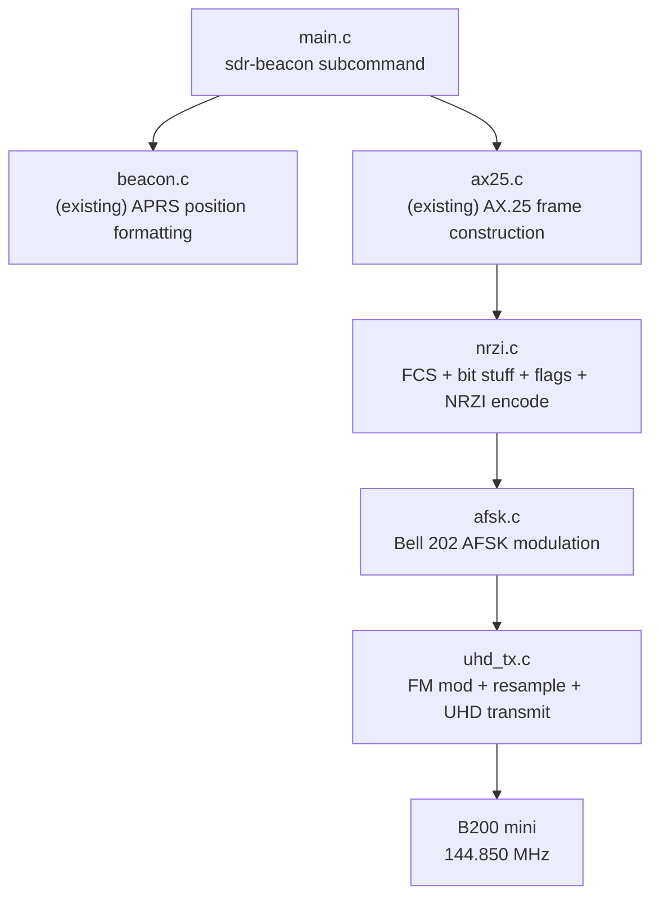

# Design Document: UHD APRS Beacon (Pure C)

## Overview

This feature implements a pure C APRS beacon transmitter using the UHD C API directly, replacing the Python/GNU Radio prototype with a native implementation that integrates into the existing `kiss-interface` codebase. The system reuses `beacon.c` for APRS position formatting and `ax25.c` for AX.25 byte-level frame construction, and adds three new modules: `nrzi.c` (NRZI encoding/decoding), `afsk.c` (Bell 202 AFSK audio generation), and `uhd_tx.c` (FM modulation, resampling, and UHD transmission).

A new `sdr-beacon` CLI subcommand in `main.c` orchestrates the full pipeline: AX.25 frame → CRC-CCITT FCS → bit stuffing → flag framing → NRZI encoding → AFSK modulation → FM modulation → resampling → UHD transmission.

All design parameters are derived from field-tested lessons learned during the GNU Radio prototype (documented in `gnuradio/LESSONS-LEARNED.md`).

### Key Design Decisions

- **Reuse existing modules**: `beacon.c` provides APRS position formatting and `ax25.c` provides AX.25 byte-level frame construction. The new modules handle everything from FCS computation through RF transmission.
- **FCS and bit stuffing in nrzi.c**: CRC-CCITT FCS computation, byte-to-bit conversion (LSB-first), bit stuffing, and flag framing are co-located with NRZI encoding in `nrzi.c` since they form a single bitstream pipeline. This keeps the module boundary clean: bytes go in, NRZI-encoded bits come out.
- **Static allocation only**: All buffers are statically sized. Maximum frame size is bounded by AX.25 limits. Audio and IQ buffers use worst-case sizing based on maximum frame length plus padding.
- **SSID byte fix**: The existing `ax25.c` uses `0x60` for the SSID reserved bits, but lessons learned (and the AX.25 spec) require `0xE0`. The new bitstream pipeline applies the `0xE0` mask when converting AX.25 frame bytes to the bitstream, correcting the reserved bits before FCS computation. This avoids modifying the existing `ax25.c` which is used by other subsystems.
- **Inverted AFSK tone mapping**: NRZI 1 → 2200 Hz, NRZI 0 → 1200 Hz. This compensates for the frequency inversion introduced by the FM modulation/demodulation chain, as discovered during field testing.
- **Direct FM modulation**: Uses `frequency_modulator` approach (sensitivity = 2π × deviation / sample_rate) rather than NBFM with pre-emphasis, which corrupts data signals.
- **Zero-order hold resampling**: Simple 10:1 integer interpolation from 48 kHz to 480 kHz. Each audio sample is repeated 10 times. This is sufficient for FM-modulated signals where the bandwidth is well below the Nyquist limit.
- **Conditional compilation**: UHD-dependent code is guarded by `#ifdef HAVE_UHD`. The rest of the project builds without libuhd installed. Test targets for `nrzi` and `afsk` have no UHD dependency.
- **CLOCK_MONOTONIC scheduling**: Beacon interval timing uses `clock_gettime(CLOCK_MONOTONIC)` to avoid drift from wall-clock adjustments, consistent with the existing `beacon.c` approach.

## Architecture



### Signal Processing Pipeline

```mermaid
graph LR
    A["AX.25 frame<br/>(bytes)"] --> B["FCS append<br/>CRC-CCITT"]
    B --> C["Byte→Bits<br/>LSB-first"]
    C --> D["Bit stuff<br/>insert 0 after 5×1"]
    D --> E["Flag frame<br/>80× 0x7E + 3× 0x7E"]
    E --> F["NRZI encode<br/>init=0"]
    F --> G["AFSK mod<br/>48 kHz, 40 samp/bit"]
    G --> H["Silence pad<br/>1s before + 1s after"]
    H --> I["FM mod<br/>sensitivity=2π×3000/48000"]
    I --> J["Resample<br/>10:1 ZOH"]
    J --> K["UHD TX<br/>480 kHz IQ"]
```



### Module Responsibilities

| Module | Responsibility |
|--------|---------------|
| `main.c` (modified) | `sdr-beacon` subcommand: CLI parsing, validation, beacon scheduling loop, SIGINT handling |
| `beacon.c` (existing) | APRS position formatting (`beacon_build_position`), callsign/coordinate validation |
| `ax25.c` (existing) | AX.25 address encoding, UI frame byte-level construction (`ax25_build_frame`) |
| `nrzi.c` (new) | CRC-CCITT FCS, byte-to-bit conversion, bit stuffing/de-stuffing, flag framing, NRZI encode/decode |
| `afsk.c` (new) | Bell 202 AFSK audio generation with continuous-phase accumulator |
| `uhd_tx.c` (new) | FM modulation, zero-order hold resampling, UHD C API hardware control, IQ streaming |


## Components and Interfaces

### nrzi.h / nrzi.c

```c
#ifndef NRZI_H
#define NRZI_H

#include <stdint.h>
#include <stddef.h>

/* Maximum AX.25 frame bytes (header + info + FCS) */
#define NRZI_MAX_FRAME_BYTES  330
/* Max bits after bit stuffing: frame_bytes*8 + worst-case stuffing + flags */
/* 330 bytes * 8 = 2640 bits, worst case stuffing ~528 extra, 83 flags * 8 = 664 */
#define NRZI_MAX_BITS         4096

#define NRZI_PREAMBLE_FLAGS   80
#define NRZI_CLOSING_FLAGS    3
#define NRZI_FLAG             0x7E

/* Compute CRC-CCITT FCS (polynomial 0x8408, init 0xFFFF, final XOR 0xFFFF).
 * Returns 16-bit FCS value. */
uint16_t nrzi_compute_fcs(const uint8_t *data, size_t len);

/* Convert frame bytes to bits (LSB-first per byte).
 * out must hold at least len*8 elements.
 * Returns number of bits written. */
size_t nrzi_bytes_to_bits(const uint8_t *data, size_t len,
                          uint8_t *out, size_t out_size);

/* Apply AX.25 bit stuffing: insert 0 after every 5 consecutive 1-bits.
 * Returns number of output bits, or -1 on overflow. */
int nrzi_bit_stuff(const uint8_t *bits, size_t num_bits,
                   uint8_t *out, size_t out_size);

/* Remove AX.25 bit stuffing (inverse of nrzi_bit_stuff).
 * Returns number of output bits, or -1 on error. */
int nrzi_bit_destuff(const uint8_t *bits, size_t num_bits,
                     uint8_t *out, size_t out_size);

/* Build complete flag-framed bitstream from AX.25 frame bytes.
 * Computes FCS, converts to bits, applies bit stuffing, adds flags.
 * Applies SSID reserved-bit fix (0xE0 mask) before FCS computation.
 * out must hold at least NRZI_MAX_BITS elements.
 * Returns total number of bits, or -1 on error. */
int nrzi_frame_to_bitstream(const uint8_t *frame, size_t frame_len,
                            uint8_t *out, size_t out_size);

/* NRZI-encode a bitstream. 0-bit toggles state, 1-bit holds.
 * initial_state: 0 (space) or 1 (mark).
 * out must hold at least num_bits elements.
 * Returns number of output bits. */
size_t nrzi_encode(const uint8_t *bits, size_t num_bits,
                   uint8_t *out, size_t out_size,
                   int initial_state);

/* NRZI-decode a bitstream (inverse of nrzi_encode).
 * Transition → 0, no transition → 1.
 * Returns number of output bits. */
size_t nrzi_decode(const uint8_t *nrzi_bits, size_t num_bits,
                   uint8_t *out, size_t out_size,
                   int initial_state);

#endif
```

### afsk.h / afsk.c

```c
#ifndef AFSK_H
#define AFSK_H

#include <stdint.h>
#include <stddef.h>

#define AFSK_MARK_FREQ    1200   /* Hz — Bell 202 mark */
#define AFSK_SPACE_FREQ   2200   /* Hz — Bell 202 space */
#define AFSK_BAUD_RATE    1200   /* symbols per second */
#define AFSK_SAMPLE_RATE  48000  /* Hz */
#define AFSK_SAMPLES_PER_BIT (AFSK_SAMPLE_RATE / AFSK_BAUD_RATE)  /* 40 */

/* Maximum AFSK audio samples: NRZI_MAX_BITS * 40 samples/bit */
#define AFSK_MAX_SAMPLES  (4096 * 40)  /* 163840 */

/* Generate Bell 202 AFSK audio from NRZI-encoded bitstream.
 * Tone mapping (inverted for FM chain): NRZI 1 → 2200 Hz, NRZI 0 → 1200 Hz.
 * Uses continuous-phase accumulator.
 * out must hold at least num_bits * AFSK_SAMPLES_PER_BIT floats.
 * Returns number of samples written, or -1 on error. */
int afsk_modulate(const uint8_t *nrzi_bits, size_t num_bits,
                  float *out, size_t out_size);

#endif
```

### uhd_tx.h / uhd_tx.c

```c
#ifndef UHD_TX_H
#define UHD_TX_H

#include <stdint.h>
#include <stddef.h>

/* Default SDR parameters */
#define UHD_TX_DEFAULT_FREQ       144850000.0  /* 144.850 MHz */
#define UHD_TX_DEFAULT_GAIN       50
#define UHD_TX_DEFAULT_SAMPLE_RATE 480000       /* Hz */
#define UHD_TX_DEFAULT_DEVIATION  3000.0        /* Hz */
#define UHD_TX_AUDIO_RATE         48000         /* Hz */
#define UHD_TX_SILENCE_SECONDS    1             /* seconds of silence padding */

/* Band limits (2-metre amateur band) */
#define UHD_TX_BAND_LOW           144000000.0   /* 144.000 MHz */
#define UHD_TX_BAND_HIGH          146000000.0   /* 146.000 MHz */

/* Gain limits */
#define UHD_TX_GAIN_MIN           0
#define UHD_TX_GAIN_MAX           89

/* Deviation limits */
#define UHD_TX_DEVIATION_MIN      1000.0
#define UHD_TX_DEVIATION_MAX      5000.0

/* SDR transmitter configuration */
typedef struct {
    double freq_hz;         /* Centre frequency in Hz */
    int    gain;            /* Transmit gain (0-89) */
    int    sdr_sample_rate; /* SDR sample rate in Hz */
    double deviation;       /* FM deviation in Hz */
    int    verbose;         /* Verbose output flag */
    void  *usrp;           /* Opaque UHD handle (uhd_usrp_handle) */
    void  *tx_streamer;    /* Opaque UHD TX streamer handle */
} uhd_tx_state_t;

/* Initialise UHD transmitter: open device, set frequency/gain/rate.
 * Returns 0 on success, -1 on error (prints to stderr). */
int uhd_tx_init(uhd_tx_state_t *state, double freq_hz, int gain,
                int sdr_sample_rate, double deviation, int verbose);

/* Transmit AFSK audio samples as FM-modulated IQ via UHD.
 * Applies silence padding, FM modulation, and resampling internally.
 * Returns 0 on success, -1 on error. */
int uhd_tx_transmit(uhd_tx_state_t *state,
                    const float *audio, size_t num_samples);

/* Release UHD hardware and clean up.
 * Safe to call even if init failed. */
void uhd_tx_cleanup(uhd_tx_state_t *state);

#endif
```

### main.c modifications (sdr-beacon subcommand)

The existing `main.c` CLI dispatch is extended with a new `CMD_MODE_SDR_BEACON` mode:

```c
/* New enum value */
CMD_MODE_SDR_BEACON

/* New fields in cli_args_t */
double sdr_freq;           /* --freq in Hz (default 144.850 MHz) */
int    sdr_gain;           /* --gain (default 50) */
int    sdr_sample_rate;    /* --sample-rate (default 480000) */
double sdr_deviation;      /* --deviation (default 3000) */

/* New function */
int run_sdr_beacon(const cli_args_t *args);
```

The `run_sdr_beacon` function:
1. Calls `beacon_build_position()` to format the APRS info field
2. Calls `ax25_build_frame()` to construct the AX.25 UI frame
3. Calls `nrzi_frame_to_bitstream()` to compute FCS, bit stuff, add flags
4. Calls `nrzi_encode()` to NRZI-encode the bitstream
5. Calls `afsk_modulate()` to generate AFSK audio
6. Calls `uhd_tx_init()` once to configure the B200
7. Loops: `uhd_tx_transmit()` → sleep until next interval (CLOCK_MONOTONIC)
8. On SIGINT: `uhd_tx_cleanup()` → exit 0

## Data Models

### Bitstream Pipeline Data Flow

```
Input: AX.25 frame bytes from ax25_build_frame()
  [dst_addr(7)] [src_addr(7)] [ctrl(1)] [pid(1)] [info(N)]
  Total: 16 + N bytes (N = position info length, typically ~40 bytes)

Step 1: SSID fix + FCS
  Fix src_addr[6] and dst_addr[6] reserved bits: (byte & 0x1F) | 0xE0
  Compute CRC-CCITT over fixed frame, append 2-byte FCS (little-endian)
  Total: 16 + N + 2 bytes

Step 2: Byte-to-bit conversion (LSB-first)
  Each byte → 8 bits, LSB first
  Total: (16 + N + 2) × 8 bits

Step 3: Bit stuffing
  Insert 0 after every 5 consecutive 1-bits
  Total: up to (16 + N + 2) × 8 × 6/5 bits (worst case)

Step 4: Flag framing
  Prepend 80 × 01111110 (640 bits)
  Append 3 × 01111110 (24 bits)
  Total: 664 + stuffed_bits

Step 5: NRZI encoding (initial state = 0)
  0-bit → toggle, 1-bit → hold
  Output: same length as input
```

### CRC-CCITT FCS

```c
uint16_t nrzi_compute_fcs(const uint8_t *data, size_t len) {
    uint16_t crc = 0xFFFF;
    for (size_t i = 0; i < len; i++) {
        crc ^= data[i];
        for (int j = 0; j < 8; j++) {
            if (crc & 1)
                crc = (crc >> 1) ^ 0x8408;
            else
                crc >>= 1;
        }
    }
    return crc ^ 0xFFFF;
}
```

FCS appended as: `[fcs & 0xFF, (fcs >> 8) & 0xFF]` (little-endian).

### AFSK Audio Parameters

| Parameter | Value | Notes |
|-----------|-------|-------|
| Sample rate | 48,000 Hz | 40 samples/bit (integer) |
| Baud rate | 1,200 | AX.25 VHF standard |
| Mark frequency | 1,200 Hz | Bell 202 |
| Space frequency | 2,200 Hz | Bell 202 |
| Tone mapping | NRZI 1 → 2200 Hz, NRZI 0 → 1200 Hz | Inverted for FM chain |
| Phase accumulator | Continuous | No discontinuities at bit boundaries |

### FM Modulation Parameters

| Parameter | Value | Notes |
|-----------|-------|-------|
| Deviation | 3,000 Hz (default) | Configurable 1000–5000 Hz |
| Sensitivity | 2π × deviation / 48000 | Radians per sample |
| Output | Complex IQ (float pairs) | Unit magnitude |
| Resampling | 10:1 zero-order hold | 48 kHz → 480 kHz |

### Signal Chain Sample Rates

| Stage | Rate | Samples/Bit |
|-------|------|-------------|
| AFSK audio | 48,000 Hz | 40 |
| FM modulated IQ | 48,000 Hz | 40 |
| Resampled IQ | 480,000 Hz | 400 |
| UHD TX | 480,000 Hz | 400 |

### CLI Arguments (sdr-beacon)

| Argument | Type | Required | Default | Range | Description |
|----------|------|----------|---------|-------|-------------|
| `--callsign` | string | Yes | — | 1-6 alnum + optional -0 to -15 | Source callsign-SSID |
| `--lat` | double | Yes | — | -90.0 to +90.0 | Latitude (decimal degrees) |
| `--lon` | double | Yes | — | -180.0 to +180.0 | Longitude (decimal degrees) |
| `--comment` | string | No | `"github.com/g4dpz/ion-dtn-terrestrial"` | ≤128 chars | APRS comment |
| `--beacon-interval` | int | No | 120 | 10–3600 | Beacon interval (seconds) |
| `--freq` | double | No | 144.850 | 144.000–146.000 MHz | Transmit frequency |
| `--gain` | int | No | 50 | 0–89 | B200 transmit gain |
| `--sample-rate` | int | No | 480000 | Must be integer multiple of 48000 | SDR sample rate (Hz) |
| `--deviation` | double | No | 3000 | 1000–5000 Hz | FM deviation |
| `--verbose` | flag | No | off | — | Verbose output |

### Static Buffer Sizing

| Buffer | Size | Rationale |
|--------|------|-----------|
| AX.25 frame | 330 bytes | AX25_HDR_LEN(16) + AX25_MAX_INFO + FCS(2) |
| Bitstream (pre-NRZI) | 4096 bits | Frame bits + stuffing + 83 flag bytes |
| NRZI output | 4096 bits | Same size as input |
| AFSK audio | 163,840 floats | 4096 bits × 40 samples/bit |
| Silence padding | 48,000 floats | 1 second at 48 kHz |
| FM IQ (audio rate) | 211,840 × 2 floats | (silence + audio + silence) complex pairs |
| Resampled IQ | 2,118,400 × 2 floats | 10:1 interpolation of FM IQ |


## Correctness Properties

*A property is a characteristic or behavior that should hold true across all valid executions of a system — essentially, a formal statement about what the system should do. Properties serve as the bridge between human-readable specifications and machine-verifiable correctness guarantees.*

### Property 1: FCS integrity

*For any* valid AX.25 frame byte sequence (16–330 bytes with valid control/PID), computing CRC-CCITT FCS (polynomial 0x8408, initial 0xFFFF, final XOR 0xFFFF) and appending the 2-byte result in little-endian order, then recomputing the FCS over the original frame bytes (excluding the appended FCS) SHALL produce a value matching the appended FCS bytes.

**Validates: Requirements 1.1, 1.6**

### Property 2: Bit stuffing round-trip

*For any* sequence of bits (0s and 1s) of length 0 to 2000, applying `nrzi_bit_stuff` followed by `nrzi_bit_destuff` SHALL reproduce the original bit sequence exactly.

**Validates: Requirements 1.4**

### Property 3: Bit stuffing prevents false flags

*For any* sequence of bits (0s and 1s) of length 1 to 2000, the output of `nrzi_bit_stuff` SHALL contain no run of six or more consecutive one bits.

**Validates: Requirements 1.5**

### Property 4: Flag framing structure

*For any* valid AX.25 frame byte sequence, the output of `nrzi_frame_to_bitstream` SHALL begin with exactly 80 repetitions of the bit pattern 01111110 (640 bits) and end with exactly 3 repetitions of the bit pattern 01111110 (24 bits).

**Validates: Requirements 1.3, 7.3**

### Property 5: NRZI encode/decode round-trip

*For any* bitstream of length 0 to 1000 containing only values 0 and 1, encoding with `nrzi_encode` (initial state 0) followed by decoding with `nrzi_decode` (initial state 0) SHALL reproduce the original bitstream exactly.

**Validates: Requirements 2.3, 11.2**

### Property 6: AFSK output length invariant

*For any* NRZI-encoded bitstream of length 1 to 200 bits, the output of `afsk_modulate` SHALL have exactly N × 40 float samples, where N is the number of input bits.

**Validates: Requirements 3.1, 3.4, 12.1**

### Property 7: AFSK tone frequency correctness

*For any* NRZI-encoded bitstream containing a run of 3 or more consecutive identical bits, the dominant frequency of the corresponding audio segment (measured by FFT peak) SHALL be within 50 Hz plus one FFT bin width of the expected frequency: 2200 Hz for NRZI state 1, 1200 Hz for NRZI state 0.

**Validates: Requirements 3.2, 3.5, 12.2**

### Property 8: AFSK sample range

*For any* NRZI-encoded bitstream of length 1 to 200 bits, all output samples from `afsk_modulate` SHALL be in the range [-1.0, +1.0].

**Validates: Requirements 12.3**

### Property 9: FM modulator unit magnitude

*For any* sequence of audio samples (floats in [-1.0, +1.0]) of length 1 to 1000, the FM-modulated complex IQ output SHALL have magnitude within floating-point tolerance of 1.0 for every sample (i.e., |I² + Q² - 1.0| < 1e-6).

**Validates: Requirements 4.4**

### Property 10: Resampler zero-order hold correctness

*For any* sequence of complex IQ sample pairs of length 1 to 500, resampling with integer ratio R SHALL produce an output of length input_length × R, where each group of R consecutive output samples equals the corresponding input sample.

**Validates: Requirements 5.1, 5.2**

### Property 11: Parameter validation

*For any* numeric value, the following validation rules SHALL hold:
- FM deviation is accepted if and only if it is in [1000.0, 5000.0] Hz
- Transmit gain is accepted if and only if it is in [0, 89]
- Centre frequency is accepted if and only if it is in [144.0, 146.0] MHz
- Beacon interval is accepted if and only if it is in [10, 3600] seconds
- SDR sample rate is accepted if and only if it is an integer multiple of the audio sample rate (48000 Hz)

**Validates: Requirements 4.3, 5.3, 6.3, 6.6, 8.3**

## Error Handling

| Condition | Behavior |
|-----------|----------|
| Missing `--callsign`, `--lat`, or `--lon` | Print usage to stderr, exit code 1 |
| Callsign invalid (empty, >6 chars, non-alnum, SSID >15) | Print error to stderr, exit code 1 |
| Latitude outside [-90.0, +90.0] | Print error to stderr, exit code 1 |
| Longitude outside [-180.0, +180.0] | Print error to stderr, exit code 1 |
| Frequency outside 144.000–146.000 MHz | Print error to stderr, exit code 1 |
| Gain outside 0–89 | Print error to stderr, exit code 1 |
| Beacon interval outside 10–3600 seconds | Print error to stderr, exit code 1 |
| FM deviation outside 1000–5000 Hz | Print error to stderr, exit code 1 |
| SDR sample rate not integer multiple of 48000 | Print error to stderr, exit code 1 |
| B200 mini not detected (UHD init failure) | Print descriptive error to stderr, return -1 from `uhd_tx_init` |
| UHD streaming error during transmit | Print error to stderr, return -1 from `uhd_tx_transmit`, continue to next beacon cycle |
| AX.25 frame construction failure | Print error to stderr, exit code 1 (fatal — configuration error) |
| NRZI bitstream buffer overflow | Return -1 from `nrzi_frame_to_bitstream` |
| AFSK output buffer overflow | Return -1 from `afsk_modulate` |
| SIGINT received | Set `g_running = 0`, call `uhd_tx_cleanup`, exit code 0 within 1 second |
| Comment string > 128 characters | Truncated to 128 characters (no error) |

## Testing Strategy

### Property-Based Tests (using [theft](https://github.com/silentbicycle/theft) when available, hand-rolled rand() otherwise)

The existing codebase uses hand-rolled random testing with `rand()/srand()` and 1000 iterations per property, with optional `theft` library support detected at build time. The new test files follow the same pattern.

Each property test runs a minimum of 1000 iterations (matching existing convention). Tests are tagged with comments referencing the design property.

| Test File | Test | Property | Iterations |
|-----------|------|----------|------------|
| `test_nrzi.c` | `test_fcs_integrity` | Property 1: FCS integrity | 1000 |
| `test_nrzi.c` | `test_bit_stuff_roundtrip` | Property 2: Bit stuffing round-trip | 1000 |
| `test_nrzi.c` | `test_bit_stuff_no_six_ones` | Property 3: Bit stuffing prevents false flags | 1000 |
| `test_nrzi.c` | `test_flag_framing_structure` | Property 4: Flag framing structure | 1000 |
| `test_nrzi.c` | `test_nrzi_roundtrip` | Property 5: NRZI encode/decode round-trip | 1000 |
| `test_afsk.c` | `test_afsk_output_length` | Property 6: AFSK output length invariant | 1000 |
| `test_afsk.c` | `test_afsk_tone_frequency` | Property 7: AFSK tone frequency correctness | 1000 |
| `test_afsk.c` | `test_afsk_sample_range` | Property 8: AFSK sample range | 1000 |
| `test_afsk.c` | `test_fm_unit_magnitude` | Property 9: FM modulator unit magnitude | 1000 |
| `test_afsk.c` | `test_resampler_zoh` | Property 10: Resampler zero-order hold | 1000 |
| `test_nrzi.c` | `test_parameter_validation` | Property 11: Parameter validation | 1000 |

Each test is tagged with: `/* Feature: uhd-aprs-beacon, Property N: <title> */`

### Unit Tests (example-based)

| Test File | Test | Validates |
|-----------|------|-----------|
| `test_nrzi.c` | `test_fcs_known_vector` — verify FCS of known AX.25 frame | Req 1.1 |
| `test_nrzi.c` | `test_bytes_to_bits_known` — verify LSB-first conversion of 0x7E | Req 1.2 |
| `test_nrzi.c` | `test_nrzi_encode_flag_pattern` — verify 0x7E produces mark-dominant NRZI output with init=0 | Req 2.2 |
| `test_nrzi.c` | `test_nrzi_encode_all_zeros` — verify alternating output | Req 2.1 |
| `test_nrzi.c` | `test_nrzi_encode_all_ones` — verify constant output | Req 2.1 |
| `test_nrzi.c` | `test_ssid_fix_applied` — verify 0xE0 mask on SSID bytes in bitstream | Design decision |
| `test_afsk.c` | `test_afsk_single_mark_bit` — verify 2200 Hz for NRZI 1 | Req 3.2 |
| `test_afsk.c` | `test_afsk_single_space_bit` — verify 1200 Hz for NRZI 0 | Req 3.2 |
| `test_afsk.c` | `test_afsk_continuous_phase` — verify no discontinuity at tone transition | Req 3.3 |

### Integration Tests (manual, with B200 hardware)

| Test | Validates |
|------|-----------|
| Run `kiss_interface sdr-beacon`, decode with direwolf `atest`, verify valid APRS packet | Req 1–7 end-to-end |
| Verify first beacon transmits immediately on startup | Req 9.1 |
| Verify repeat at configured interval | Req 9.1 |
| Ctrl-C exits cleanly within 1 second | Req 8.5 |
| Run with `--freq 144.850`, verify SDR transmits on correct frequency | Req 6.1 |
| Build without libuhd installed, verify rest of project compiles | Req 10.2 |
| Build on Raspberry Pi (ARM), verify clean compilation | Req 13.1 |

### Build System Test Targets

```makefile
test_nrzi: test_nrzi.c nrzi.c
	$(CC) $(CFLAGS) -o $@ $^ $(THEFT_FLAGS) -lm

test_afsk: test_afsk.c afsk.c nrzi.c
	$(CC) $(CFLAGS) -o $@ $^ $(THEFT_FLAGS) -lm
```

Note: `test_nrzi` and `test_afsk` have no UHD dependency and can run on any platform. The `uhd_tx.c` module is only tested via integration tests with hardware.
