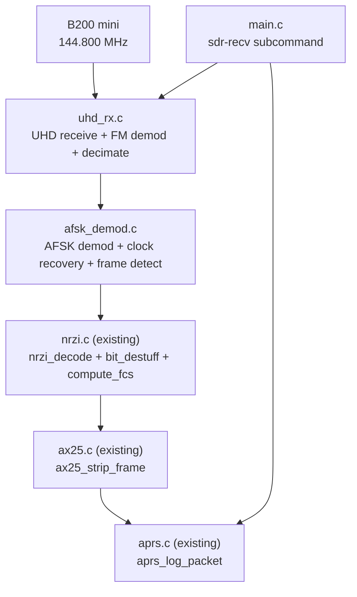
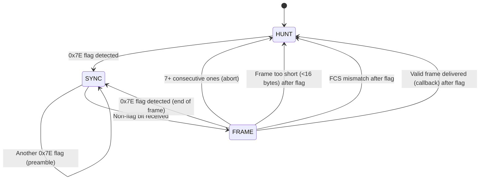

# Design Document: UHD APRS Receive (Pure C)

## Overview

This feature implements the APRS receive path using the Ettus B200 mini SDR via the UHD C API, completing the reverse signal chain from the existing SDR beacon transmitter. The system receives FM-modulated AFSK packets on 144.800 MHz, demodulates them through a multi-stage DSP pipeline, and decodes AX.25/APRS position reports using the existing `aprs.c` and `ax25.c` modules.

The RX signal chain is the inverse of the existing TX path:

```
UHD Source (480 kHz IQ) → FM demod → Decimate 10:1 (48 kHz audio)
→ AFSK demod → NRZI decode → Flag detect → Destuff → FCS verify
→ AX.25 parse → APRS decode → Display
```

Two new modules are added: `uhd_rx.c/uhd_rx.h` (UHD receive, FM demodulation, decimation) and `afsk_demod.c/afsk_demod.h` (AFSK correlation demodulator, clock recovery, frame detection). A new `sdr-recv` CLI subcommand in `main.c` orchestrates the pipeline.

### Key Design Decisions

- **atan2 FM discriminator**: Computes instantaneous frequency as the phase difference between consecutive IQ samples using `atan2(cross, dot)` where `cross = I[n-1]*Q[n] - Q[n-1]*I[n]` and `dot = I[n-1]*I[n] + Q[n-1]*Q[n]`. This avoids explicit phase unwrapping and is numerically robust.
- **Simple moving-average decimation filter**: A boxcar (rectangular window) low-pass filter of length 10 (the decimation ratio) applied before decimation. This provides 20 dB stopband attenuation at the folding frequency, sufficient for AFSK where the signal bandwidth (3 kHz) is well below the decimated Nyquist (24 kHz). The passband attenuation at 3 kHz is < 0.5 dB.
- **Correlation-based AFSK demodulator**: Each bit period (40 samples at 48 kHz) is correlated with pre-computed reference mark (1200 Hz) and space (2200 Hz) sinusoids. The tone with the higher correlation magnitude is selected. This is equivalent to a matched filter and provides good noise rejection.
- **Zero-crossing clock recovery**: Bit timing is adjusted by detecting tone transitions (sign changes in the mark-space correlation difference). When a transition is detected, the sampling phase is nudged toward the centre of the next bit period. This is simpler than an early-late gate and sufficient for the ±50 ppm clock tolerance requirement.
- **Dual polarity via parallel decode**: The AFSK demodulator runs the frame detection pipeline for both normal and inverted polarity simultaneously. When a valid frame (passing FCS) is found with either polarity, it is accepted. This handles the FM chain tone inversion documented in `LESSONS-LEARNED.md` item 4 without manual configuration.
- **Flag detection state machine**: A shift register scans the NRZI-decoded bitstream for the 0x7E flag pattern (01111110). States: HUNT (searching for first flag), SYNC (found flag, accumulating frame bits), FRAME (between opening and closing flags). Six consecutive 1-bits without a following 0 (i.e., 7+ ones) resets to HUNT (abort — invalid sequence).
- **Static allocation only**: All buffers are statically sized with worst-case bounds. The IQ receive buffer holds one chunk of 4800 samples (10 ms at 480 kHz). The frame accumulation buffer holds up to NRZI_MAX_BITS. Audio and correlation buffers are sized for the decimated chunk.
- **Reuse existing modules**: `nrzi_decode`, `nrzi_bit_destuff`, `nrzi_compute_fcs` from `nrzi.c`; `ax25_strip_frame` from `ax25.c`; `aprs_decode_position`, `aprs_log_packet` from `aprs.c`.
- **Conditional compilation**: UHD-dependent code in `uhd_rx.c` is guarded by `#ifdef HAVE_UHD`, consistent with `uhd_tx.c`. The DSP functions (FM demod, decimation) are always compiled for testability.

## Architecture



### RX Signal Processing Pipeline

```mermaid
graph LR
    A["IQ samples<br/>480 kHz fc32"] --> B["FM demod<br/>atan2 discriminator"]
    B --> C["Moving-avg LPF<br/>length 10"]
    C --> D["Decimate 10:1<br/>→ 48 kHz audio"]
    D --> E["Correlate with<br/>mark/space refs"]
    E --> F["Clock recovery<br/>zero-crossing"]
    F --> G["NRZI decode<br/>nrzi_decode()"]
    G --> H["Flag detect<br/>state machine"]
    H --> I["Bit destuff<br/>nrzi_bit_destuff()"]
    I --> J["FCS verify<br/>nrzi_compute_fcs()"]
    J --> K["AX.25 parse<br/>ax25_strip_frame()"]
    K --> L["APRS decode<br/>aprs_log_packet()"]
```



### Module Responsibilities

| Module | Responsibility |
|--------|---------------|
| `main.c` (modified) | `sdr-recv` subcommand: CLI parsing, validation, receive loop, SIGINT handling, frame count summary |
| `uhd_rx.c` (new) | UHD C API receive setup, IQ streaming, FM demodulation (atan2), moving-average LPF, 10:1 decimation |
| `afsk_demod.c` (new) | Correlation tone detection, zero-crossing clock recovery, NRZI decode, flag detection state machine, bit destuffing, FCS verification, dual polarity handling |
| `nrzi.c` (existing) | `nrzi_decode`, `nrzi_bit_destuff`, `nrzi_compute_fcs` |
| `ax25.c` (existing) | `ax25_strip_frame` — extract callsigns and info field |
| `aprs.c` (existing) | `aprs_decode_position`, `aprs_log_packet` — decode and display |

## Components and Interfaces

### uhd_rx.h / uhd_rx.c

```c
#ifndef UHD_RX_H
#define UHD_RX_H

#include <stdint.h>
#include <stddef.h>

/* Default RX parameters */
#define UHD_RX_DEFAULT_FREQ        144800000.0  /* 144.800 MHz */
#define UHD_RX_DEFAULT_GAIN        50
#define UHD_RX_DEFAULT_SAMPLE_RATE 480000        /* Hz */
#define UHD_RX_AUDIO_RATE          48000         /* Hz */
#define UHD_RX_DEFAULT_DEVIATION   3000.0        /* Hz — for FM demod normalisation */

/* Band limits (2-metre amateur band) */
#define UHD_RX_BAND_LOW            144000000.0
#define UHD_RX_BAND_HIGH           146000000.0

/* Gain limits (B200 mini RX) */
#define UHD_RX_GAIN_MIN            0
#define UHD_RX_GAIN_MAX            76

/* IQ chunk size: 10 ms at 480 kHz = 4800 samples */
#define UHD_RX_CHUNK_SAMPLES       4800

/* Decimation filter length (= decimation ratio) */
#define UHD_RX_DECIM_RATIO         10

/* Audio chunk after decimation: 4800 / 10 = 480 samples */
#define UHD_RX_AUDIO_CHUNK         (UHD_RX_CHUNK_SAMPLES / UHD_RX_DECIM_RATIO)

/* SDR receiver state */
typedef struct {
    double freq_hz;
    int    gain;
    int    sdr_sample_rate;
    double deviation;
    int    decim_ratio;
    int    verbose;
    void  *usrp;            /* Opaque UHD handle */
    void  *rx_streamer;     /* Opaque UHD RX streamer */
    void  *rx_metadata;     /* Opaque UHD RX metadata */
    int    initialized;
    /* FM demod state: previous IQ sample */
    float  prev_i;
    float  prev_q;
    /* Moving-average filter state (ring buffer) */
    float  lpf_buf[UHD_RX_DECIM_RATIO];
    int    lpf_idx;
    float  lpf_sum;
} uhd_rx_state_t;

/* Validate RX parameters. Returns 0 if valid, -1 if invalid. */
int uhd_rx_validate(double freq_hz, int gain, int sdr_sample_rate);

/* FM demodulate: IQ pairs → real-valued audio.
 * Uses atan2(cross, dot) discriminator.
 * Normalises output to [-1.0, +1.0] based on max_deviation.
 * Maintains state->prev_i/prev_q across calls.
 * out must hold at least num_samples floats.
 * Returns number of audio samples written. */
int uhd_rx_fm_demod(uhd_rx_state_t *state,
                    const float *iq_i, const float *iq_q,
                    size_t num_samples,
                    float *out);

/* Low-pass filter and decimate by state->decim_ratio.
 * Moving-average filter of length decim_ratio.
 * Maintains filter state across calls.
 * out must hold at least num_samples/decim_ratio floats.
 * Returns number of decimated samples written. */
int uhd_rx_decimate(uhd_rx_state_t *state,
                    const float *audio, size_t num_samples,
                    float *out, size_t out_size);

#ifdef HAVE_UHD

/* Initialise UHD receiver: open device, set frequency/gain/rate.
 * Returns 0 on success, -1 on error. */
int uhd_rx_init(uhd_rx_state_t *state, double freq_hz, int gain,
                int sdr_sample_rate, double deviation, int verbose);

/* Receive one chunk of IQ samples from UHD.
 * out_i and out_q must hold at least UHD_RX_CHUNK_SAMPLES floats.
 * Returns number of IQ pairs received, or -1 on error. */
int uhd_rx_receive(uhd_rx_state_t *state,
                   float *out_i, float *out_q, size_t max_samples);

/* Release UHD hardware and clean up. */
void uhd_rx_cleanup(uhd_rx_state_t *state);

#endif /* HAVE_UHD */

#endif /* UHD_RX_H */
```

### afsk_demod.h / afsk_demod.c

```c
#ifndef AFSK_DEMOD_H
#define AFSK_DEMOD_H

#include <stdint.h>
#include <stddef.h>

#define AFSK_DEMOD_SAMPLE_RATE   48000
#define AFSK_DEMOD_BAUD_RATE     1200
#define AFSK_DEMOD_SAMPLES_PER_BIT (AFSK_DEMOD_SAMPLE_RATE / AFSK_DEMOD_BAUD_RATE) /* 40 */
#define AFSK_DEMOD_MARK_FREQ     1200
#define AFSK_DEMOD_SPACE_FREQ    2200

/* Maximum frame bits between flags (330 bytes * 8 + stuffing) */
#define AFSK_DEMOD_MAX_FRAME_BITS 4096
/* Maximum frame bytes after destuffing */
#define AFSK_DEMOD_MAX_FRAME_BYTES 330

/* Flag pattern: 01111110 */
#define AFSK_DEMOD_FLAG 0x7E

/* Frame detector state machine states */
typedef enum {
    AFSK_DEMOD_HUNT,   /* Searching for first flag */
    AFSK_DEMOD_SYNC,   /* Found flag, looking for non-flag data */
    AFSK_DEMOD_FRAME   /* Accumulating frame bits */
} afsk_demod_state_t;

/* Callback for decoded frames */
typedef void (*afsk_demod_frame_cb)(const uint8_t *frame, size_t frame_len,
                                    int polarity, void *user_data);

/* AFSK demodulator state */
typedef struct {
    /* Correlation reference waveforms (pre-computed) */
    float mark_ref_sin[AFSK_DEMOD_SAMPLES_PER_BIT];
    float mark_ref_cos[AFSK_DEMOD_SAMPLES_PER_BIT];
    float space_ref_sin[AFSK_DEMOD_SAMPLES_PER_BIT];
    float space_ref_cos[AFSK_DEMOD_SAMPLES_PER_BIT];

    /* Clock recovery state */
    float  phase;           /* Current sampling phase (0.0 to 1.0 in bit periods) */
    float  prev_corr_diff;  /* Previous mark-space correlation difference for zero-crossing */

    /* Frame detector state (one per polarity) */
    afsk_demod_state_t det_state[2];    /* [0]=normal, [1]=inverted */
    uint8_t frame_bits[2][AFSK_DEMOD_MAX_FRAME_BITS];
    size_t  frame_bit_count[2];
    uint8_t shift_reg[2];               /* 8-bit shift register for flag detection */
    int     consecutive_ones[2];        /* For detecting invalid sequences (7+ ones) */

    /* Callback */
    afsk_demod_frame_cb callback;
    void *user_data;

    /* Statistics */
    int frames_decoded;
    int verbose;
} afsk_demod_t;

/* Initialise AFSK demodulator. Pre-computes reference waveforms. */
void afsk_demod_init(afsk_demod_t *demod, afsk_demod_frame_cb cb,
                     void *user_data, int verbose);

/* Process a chunk of audio samples.
 * Detects tones, recovers clock, decodes NRZI, detects frames.
 * Calls callback for each valid frame found.
 * Returns number of valid frames found in this chunk. */
int afsk_demod_process(afsk_demod_t *demod,
                       const float *audio, size_t num_samples);

/* Correlate a single bit period with mark and space references.
 * Returns the NRZI bit value: 1 for mark, 0 for space.
 * corr_diff is set to (mark_magnitude - space_magnitude) for clock recovery. */
int afsk_demod_correlate(const afsk_demod_t *demod,
                         const float *samples, size_t num_samples,
                         float *corr_diff);

/* Process a single decoded bit through the frame detector.
 * polarity: 0=normal, 1=inverted.
 * Handles flag detection, destuffing, FCS verification.
 * Calls callback if a valid frame is found.
 * Returns 1 if a valid frame was found, 0 otherwise. */
int afsk_demod_feed_bit(afsk_demod_t *demod, uint8_t bit, int polarity);

/* Reset demodulator state (e.g., after loss of signal). */
void afsk_demod_reset(afsk_demod_t *demod);

#endif /* AFSK_DEMOD_H */
```

### main.c modifications (sdr-recv subcommand)

```c
/* New enum value */
CMD_MODE_SDR_RECV

/* New fields reuse existing sdr_freq, sdr_gain, sdr_sample_rate from cli_args_t.
 * Default freq changes to 144.800 MHz for receive. */

/* New function */
int run_sdr_recv(const cli_args_t *args);
```

The `run_sdr_recv` function:
1. Validates parameters via `uhd_rx_validate`
2. Calls `uhd_rx_init()` to configure the B200 for receive
3. Initialises `afsk_demod_t` with a frame callback
4. Loops until SIGINT:
   - `uhd_rx_receive()` → IQ chunk (4800 samples)
   - `uhd_rx_fm_demod()` → FM audio (4800 samples)
   - `uhd_rx_decimate()` → audio chunk (480 samples)
   - `afsk_demod_process()` → decoded frames via callback
5. Frame callback: `aprs_log_packet()` for display
6. On SIGINT: `uhd_rx_cleanup()` → print summary → exit 0

## Data Models

### FM Discriminator Algorithm

The atan2-based FM discriminator extracts instantaneous frequency from consecutive IQ samples:

```
Given: z[n] = I[n] + jQ[n]  (complex IQ sample)

Phase difference: Δφ = arg(z[n] · conj(z[n-1]))

Computed without explicit phase:
  cross = I[n-1] · Q[n] - Q[n-1] · I[n]    (imaginary part of product)
  dot   = I[n-1] · I[n] + Q[n-1] · Q[n]    (real part of product)
  Δφ    = atan2(cross, dot)

Normalised output: audio[n] = Δφ / (2π · max_deviation / sample_rate)
                             = Δφ / sensitivity

Where sensitivity = 2π · 3000 / 480000 ≈ 0.03927 rad/sample
```

This produces one audio sample per IQ sample at the SDR rate (480 kHz).

### Decimation Filter

Moving-average (boxcar) low-pass filter of length L = 10 (the decimation ratio):

```
y[n] = (1/L) · Σ(k=0 to L-1) x[n-k]

Output one sample per L input samples (decimate by L).
```

Frequency response: `H(f) = sin(πfL/fs) / (L · sin(πf/fs))`

| Frequency | Attenuation |
|-----------|-------------|
| 0 Hz (DC) | 0 dB |
| 3,000 Hz (AFSK BW) | -0.4 dB |
| 24,000 Hz (folding) | -20 dB |

The filter state (ring buffer of L samples and running sum) is maintained across chunk boundaries for continuous operation.

### AFSK Correlation Demodulator

For each bit period of 40 samples, compute correlation with pre-computed reference waveforms:

```
mark_corr  = √(Σ(s[n]·sin_1200[n])² + Σ(s[n]·cos_1200[n])²)
space_corr = √(Σ(s[n]·sin_2200[n])² + Σ(s[n]·cos_2200[n])²)

NRZI bit = (mark_corr > space_corr) ? 1 : 0
```

Reference waveforms are pre-computed at init time:
```c
for (int n = 0; n < 40; n++) {
    mark_ref_sin[n]  = sin(2π · 1200 · n / 48000);
    mark_ref_cos[n]  = cos(2π · 1200 · n / 48000);
    space_ref_sin[n] = sin(2π · 2200 · n / 48000);
    space_ref_cos[n] = cos(2π · 2200 · n / 48000);
}
```

The correlation difference `(mark_corr - space_corr)` is also used for clock recovery.

### Clock Recovery (Zero-Crossing)

Bit timing is adjusted by detecting zero crossings in the correlation difference signal:

```
corr_diff[n] = mark_corr - space_corr

When sign(corr_diff[n]) ≠ sign(corr_diff[n-1]):
    → Tone transition detected
    → Adjust sampling phase toward centre of next bit period
    → phase_correction = α · (phase_error)
    → α = 0.5 (convergence rate — re-syncs within ~4 bit periods)
```

The clock recovery maintains a fractional phase accumulator that advances by 1.0 per bit period. When the phase crosses 1.0, a bit decision is made. The zero-crossing adjustment nudges the phase to keep sampling centred.

This tolerates ±50 ppm clock offset: at 1200 baud, 50 ppm = 0.06 Hz drift, which accumulates to only 0.05 samples per bit period — well within the correction range.

### Flag Detection State Machine



The shift register tracks the last 8 NRZI-decoded bits. When it matches 0x7E (01111110 in LSB-first), a flag is detected. In FRAME state, bits are accumulated (excluding flags). On closing flag:
1. Remove bit stuffing via `nrzi_bit_destuff()`
2. Convert bits to bytes (LSB-first per byte)
3. Extract last 2 bytes as received FCS
4. Recompute FCS over remaining bytes via `nrzi_compute_fcs()`
5. Compare — if match, deliver frame via callback

### Dual Polarity Handling

Two independent frame detector instances run in parallel:
- **Normal polarity**: correlation bit 1 = mark (1200 Hz), 0 = space (2200 Hz)
- **Inverted polarity**: correlation bit 1 = space (2200 Hz), 0 = mark (1200 Hz)

Both receive the same correlation output but with inverted bit sense. Each maintains its own shift register, frame buffer, and state machine. When either produces a valid frame (FCS match), it is accepted. In verbose mode, the polarity is reported.

This costs negligible CPU (the correlation is computed once; only the bit-level state machine is duplicated) and eliminates the need for manual polarity configuration.

### Static Buffer Sizing

| Buffer | Size | Rationale |
|--------|------|-----------|
| IQ receive chunk (I) | 4800 floats | 10 ms at 480 kHz |
| IQ receive chunk (Q) | 4800 floats | 10 ms at 480 kHz |
| FM audio (pre-decimate) | 4800 floats | Same as IQ chunk |
| Decimated audio | 480 floats | 4800 / 10 |
| LPF ring buffer | 10 floats | Decimation ratio |
| Mark/space reference waveforms | 4 × 40 floats | sin/cos for each tone |
| Frame bit accumulator (per polarity) | 4096 bits | NRZI_MAX_BITS |
| Destuffed bits | 4096 bits | Worst case |
| Frame bytes | 330 bytes | NRZI_MAX_FRAME_BYTES |

### RX Signal Chain Parameters

| Parameter | Value | Notes |
|-----------|-------|-------|
| SDR sample rate | 480,000 Hz | B200 mini minimum safe rate |
| Audio sample rate | 48,000 Hz | After 10:1 decimation |
| Decimation ratio | 10 | Integer ratio |
| Baud rate | 1,200 | AX.25 VHF standard |
| Samples per bit | 40 | At 48 kHz audio rate |
| Mark frequency | 1,200 Hz | Bell 202 |
| Space frequency | 2,200 Hz | Bell 202 |
| FM deviation | 3,000 Hz | Standard APRS |
| FM sensitivity | 2π × 3000 / 480000 | ≈ 0.03927 rad/sample |
| Default RX frequency | 144.800 MHz | UK APRS |
| Default RX gain | 50 | B200 range 0–76 |
| Clock recovery α | 0.5 | Re-sync within ~4 bits |

### CLI Arguments (sdr-recv)

| Argument | Type | Required | Default | Range | Description |
|----------|------|----------|---------|-------|-------------|
| `--freq` | double | No | 144.800 | 144.000–146.000 MHz | Receive frequency |
| `--gain` | int | No | 50 | 0–76 | B200 receive gain |
| `--sample-rate` | int | No | 480000 | Integer multiple of 48000 | SDR sample rate (Hz) |
| `--verbose` | flag | No | off | — | Verbose output (hex dump, polarity) |


## Correctness Properties

*A property is a characteristic or behavior that should hold true across all valid executions of a system — essentially, a formal statement about what the system should do. Properties serve as the bridge between human-readable specifications and machine-verifiable correctness guarantees.*

### Property 1: RX parameter validation

*For any* numeric values for frequency, gain, and sample rate, the `uhd_rx_validate` function SHALL accept the parameters if and only if: the frequency is within [144,000,000, 146,000,000] Hz, the gain is within [0, 76], and the sample rate is a positive integer multiple of 48,000 Hz.

**Validates: Requirements 1.4, 1.5, 3.4**

### Property 2: FM demodulator accuracy

*For any* constant-frequency complex sinusoid at frequency offset f within the range [-5000, +5000] Hz relative to the centre frequency, sampled at 480,000 Hz, the FM demodulator SHALL produce an output whose mean value is within 5% of the expected normalised value f/max_deviation.

**Validates: Requirements 2.1, 2.3, 2.4**

### Property 3: FM demodulator output length

*For any* sequence of N complex IQ sample pairs (N ≥ 1), the FM demodulator SHALL produce exactly N real-valued audio samples.

**Validates: Requirements 2.2**

### Property 4: Decimation output length

*For any* audio signal of length N samples where N is a positive multiple of the decimation ratio (10), the decimator SHALL produce exactly N/10 output samples.

**Validates: Requirements 3.1**

### Property 5: Decimation passband preservation

*For any* sinusoidal audio signal at a frequency between 100 Hz and 3,000 Hz, sampled at 480,000 Hz, the decimator SHALL preserve the signal with less than 3 dB attenuation (output RMS amplitude ≥ 0.707 × input RMS amplitude).

**Validates: Requirements 3.3**

### Property 6: AFSK demodulator output length

*For any* audio segment of length N × 40 samples (where N is 1 to 200 and 40 is the samples-per-bit at 48 kHz), the AFSK correlation demodulator SHALL produce exactly N output bits.

**Validates: Requirements 4.4, 12.1**

### Property 7: AFSK demodulator output range

*For any* audio input, all output bits from the AFSK demodulator SHALL have values restricted to 0 or 1.

**Validates: Requirements 12.3**

### Property 8: AFSK modulation/demodulation round-trip

*For any* NRZI bitstream of length 10 to 200 bits containing only values 0 and 1, modulating with the existing `afsk_modulate` function and then demodulating with the new `afsk_demod_correlate` function SHALL recover the original NRZI bitstream exactly (in the absence of noise or channel impairment).

**Validates: Requirements 4.1, 4.5, 12.2**

### Property 9: Dual polarity frame detection

*For any* valid AX.25 frame processed through the TX pipeline (FCS → bit stuff → flag frame → NRZI encode → AFSK modulate), the AFSK demodulator with dual polarity detection SHALL successfully decode the frame regardless of whether the audio tone sense is normal or inverted (i.e., swapping mark and space frequencies).

**Validates: Requirements 4.3, 14.1**

### Property 10: FM modulation/demodulation frequency round-trip

*For any* sinusoidal audio tone at a frequency between 1,000 Hz and 2,500 Hz, FM modulation using the existing `uhd_tx_fm_modulate` function followed by FM demodulation using the new `uhd_rx_fm_demod` function SHALL produce an output whose dominant frequency matches the input frequency within 50 Hz.

**Validates: Requirements 11.1**

### Property 11: Full TX/RX frame round-trip

*For any* valid AX.25 UI frame constructed by `ax25_build_frame` with a callsign of 1–6 alphanumeric characters and an info field of 1–200 bytes, processing through the complete TX pipeline (FCS → bit stuff → flag frame → NRZI encode → AFSK modulate) followed by the complete RX pipeline (AFSK demodulate → NRZI decode → flag detect → bit destuff → FCS verify) SHALL recover the original AX.25 frame bytes exactly.

**Validates: Requirements 7.7, 11.2**

## Error Handling

| Condition | Behavior |
|-----------|----------|
| Frequency outside 144.000–146.000 MHz | Print error to stderr, exit code 1 |
| Gain outside 0–76 | Print error to stderr, exit code 1 |
| Sample rate not integer multiple of 48000 | Print error to stderr, exit code 1 |
| B200 mini not detected (UHD init failure) | Print descriptive error to stderr, return -1 from `uhd_rx_init` |
| UHD streaming error during receive | Print error to stderr, return -1 from `uhd_rx_receive`, continue receive loop |
| UHD overflow (samples dropped) | Print warning to stderr in verbose mode, continue |
| FCS mismatch on received frame | Discard frame silently, continue scanning |
| Frame shorter than 16 bytes after destuffing | Discard frame silently, continue scanning |
| 7+ consecutive one bits in frame data | Abort frame (invalid sequence), reset to HUNT state |
| Frame bit accumulator overflow (>4096 bits) | Abort frame, reset to HUNT state |
| SIGINT received | Set `g_running = 0`, call `uhd_rx_cleanup`, print summary, exit code 0 within 1 second |
| No `--freq` / `--gain` / `--sample-rate` specified | Use defaults (144.800 MHz, 50, 480000) |
| Missing subcommand or unknown command | Print usage to stderr, exit code 1 |

## Testing Strategy

### Property-Based Tests (hand-rolled rand() with 1000 iterations, consistent with existing codebase)

Each property test runs 1000 iterations with random inputs. Tests are tagged with comments referencing the design property. The existing codebase uses `rand()/srand()` with optional `theft` library support.

| Test File | Test | Property | Iterations |
|-----------|------|----------|------------|
| `test_uhd_rx.c` | `test_rx_param_validation` | Property 1: RX parameter validation | 1000 |
| `test_uhd_rx.c` | `test_fm_demod_accuracy` | Property 2: FM demodulator accuracy | 1000 |
| `test_uhd_rx.c` | `test_fm_demod_output_length` | Property 3: FM demodulator output length | 1000 |
| `test_uhd_rx.c` | `test_decimate_output_length` | Property 4: Decimation output length | 1000 |
| `test_uhd_rx.c` | `test_decimate_passband` | Property 5: Decimation passband preservation | 1000 |
| `test_uhd_rx.c` | `test_fm_mod_demod_roundtrip` | Property 10: FM mod/demod frequency round-trip | 1000 |
| `test_afsk_demod.c` | `test_afsk_demod_output_length` | Property 6: AFSK demod output length | 1000 |
| `test_afsk_demod.c` | `test_afsk_demod_output_range` | Property 7: AFSK demod output range | 1000 |
| `test_afsk_demod.c` | `test_afsk_mod_demod_roundtrip` | Property 8: AFSK mod/demod round-trip | 1000 |
| `test_afsk_demod.c` | `test_dual_polarity` | Property 9: Dual polarity frame detection | 1000 |
| `test_afsk_demod.c` | `test_full_tx_rx_roundtrip` | Property 11: Full TX/RX frame round-trip | 1000 |

Each test is tagged with: `/* Feature: uhd-aprs-receive, Property N: <title> */`

### Unit Tests (example-based)

| Test File | Test | Validates |
|-----------|------|-----------|
| `test_uhd_rx.c` | `test_fm_demod_dc_input` — DC IQ input (no frequency offset) produces zero audio output | Req 2.1 |
| `test_uhd_rx.c` | `test_fm_demod_known_tone` — 1200 Hz offset sinusoid produces correct normalised output | Req 2.4 |
| `test_uhd_rx.c` | `test_decimate_known_signal` — known 1200 Hz tone survives decimation | Req 3.2, 3.3 |
| `test_uhd_rx.c` | `test_validate_good_params` — default params (144.8 MHz, 50, 480000) accepted | Req 1.2, 1.3, 1.4 |
| `test_uhd_rx.c` | `test_validate_bad_freq` — 100 MHz rejected | Req 1.5 |
| `test_uhd_rx.c` | `test_validate_bad_gain` — gain 80 rejected | Req 1.4 |
| `test_uhd_rx.c` | `test_validate_bad_rate` — 100000 Hz (not multiple of 48000) rejected | Req 3.4 |
| `test_afsk_demod.c` | `test_correlate_mark_tone` — pure 1200 Hz tone detected as mark | Req 4.1 |
| `test_afsk_demod.c` | `test_correlate_space_tone` — pure 2200 Hz tone detected as space | Req 4.1 |
| `test_afsk_demod.c` | `test_flag_detection` — 0x7E bit pattern detected as flag | Req 7.1 |
| `test_afsk_demod.c` | `test_short_frame_rejected` — frame < 16 bytes discarded | Req 7.6 |
| `test_afsk_demod.c` | `test_bad_fcs_rejected` — frame with corrupted FCS discarded | Req 7.5 |
| `test_afsk_demod.c` | `test_seven_ones_abort` — 7 consecutive ones aborts frame | Req 7.6 |

### Integration Tests (manual, with B200 hardware)

| Test | Validates |
|------|-----------|
| Run `kiss_interface sdr-recv`, receive live APRS packets, verify decoded output | Req 1–8 end-to-end |
| Run `sdr-beacon` on one B200, `sdr-recv` on another, verify round-trip | Req 7.7, 11.2 |
| Ctrl-C exits cleanly within 1 second, prints frame count summary | Req 9.3, 9.5 |
| Run with `--freq 144.800 --gain 40 --verbose`, verify startup message and hex output | Req 9.1, 9.4, 8.4 |
| Build without libuhd installed, verify rest of project compiles | Req 10.2 |
| Build on Raspberry Pi (ARM), verify clean compilation | Req 13.1 |
| Verify no malloc/free in new source files | Req 13.2 |

### Build System Test Targets

```makefile
test_uhd_rx: test_uhd_rx.c uhd_rx.c uhd_tx.c
	$(CC) $(CFLAGS) -o $@ $^ $(THEFT_FLAGS) -lm

test_afsk_demod: test_afsk_demod.c afsk_demod.c afsk.c nrzi.c ax25.c
	$(CC) $(CFLAGS) -o $@ $^ $(THEFT_FLAGS) -lm
```

Note: `test_uhd_rx` links `uhd_tx.c` for the FM mod/demod round-trip test (Property 10). `test_afsk_demod` links `afsk.c`, `nrzi.c`, and `ax25.c` for the full TX/RX round-trip test (Property 11). Neither test target requires UHD hardware.
